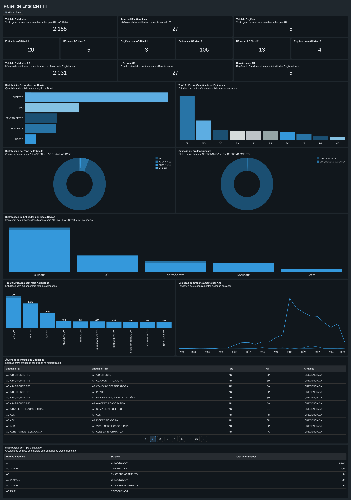

# 🏛️ ETL ITI - ICP-Brasil (Databricks Lakehouse & Asset Bundles)

> ⚠️ **Status do Projeto:** 🚧 **Em Desenvolvimento (*Work in Progress*)**  
> Pipeline de engenharia de dados voltado à extração, normalização, modelagem dimensional e carga de dados públicos de entidades e certificados digitais da Infraestrutura de Chaves Públicas Brasileira (ICP-Brasil) no Databricks Unity Catalog.

---

## 1. 📌 Introdução e Visão Geral da Arquitetura

O presente projeto tem por finalidade realizar a extração automatizada, o processamento e a disponibilização analítica dos dados abertos governamentais disponibilizados pelo **Instituto Nacional de Tecnologia da Informação (ITI)**. O fluxo abrange entidades certificadoras (Autoridades Certificadoras — ACs, Autoridades de Registro — ARs, Autoridades de Carimbo do Tempo — ACTs e Prestadores de Serviço de Suporte — PSS).

A arquitetura de dados segue o padrão **Medalhão** no **Databricks Lakehouse**, garantindo rastreabilidade, governança via **Unity Catalog** e qualidade em cada camada de processamento:

```text
                  [ API Oficial do ITI / ICP-Brasil ]
                                  │
                                  ▼ (Módulo de Extração & Flatten)
┌──────────────────────────────────────────────────────────────────────────────────┐
│ Camada 0_raw (Volumes do Unity Catalog)                                          │
│ └── Volume: /Volumes/lakehouse_iti/0_raw/raw/entidades.json                      │
└─────────────────────────────────┬────────────────────────────────────────────────┘
                                  │
                                  ▼ (Conversão CSV & Statement Execution API / DLT)
┌──────────────────────────────────────────────────────────────────────────────────┐
│ Camada 1_bronze (Volumes & Tabelas Delta)                                        │
│ ├── Volume: /Volumes/lakehouse_iti/1_bronze/raw/entidades.csv                    │
│ └── Tabela Delta: lakehouse_iti.1_bronze.entidades (com metadados e auditoria)   │
└─────────────────────────────────┬────────────────────────────────────────────────┘
                                  │
                                  ▼ (Transformações, Deduplicação & PySpark Serverless)
┌──────────────────────────────────────────────────────────────────────────────────┐
│ Camada 2_silver (Tabelas Delta Normalizadas & Enriquecidas)                      │
│ ├── Tabela Delta: lakehouse_iti.2_silver.tbl_entidades                           │
│ ├── Tabela Delta: lakehouse_iti.2_silver.tbl_enderecos (com região e end. compl.)│
│ └── Tabela Delta: lakehouse_iti.2_silver.tbl_hierarquia                          │
└─────────────────────────────────┬────────────────────────────────────────────────┘
                                  │
                                  ▼ (Modelagem Dimensional & Visões Analíticas)
┌──────────────────────────────────────────────────────────────────────────────────┐
│ Camada 3_gold (Tabelas Delta Dimensionais & Fatos de Consumo)                    │
│ ├── Dimensão: lakehouse_iti.3_gold.dim_entidade (enriquecida com região e audit.)│
│ ├── Dimensão: lakehouse_iti.3_gold.dim_hierarquia (árvore de subordinação)       │
│ └── Fato:     lakehouse_iti.3_gold.fato_metricas_entidades (métricas da cadeia)  │
└─────────────────────────────────┬────────────────────────────────────────────────┘
                                  │
                                  ▼ (Visualização Analítica & Tomada de Decisão)
┌──────────────────────────────────────────────────────────────────────────────────┐
│ Camada de BI & Analytics (Databricks AI/BI Lakeview Dashboard)                   │
│ └── Painel: Painel de Entidades ITI (deploy declarativo via Databricks Bundle)   │
│     ├── 21 Visualizações: KPIs, Rankings, Georreferenciamento e Séries Temporais │
│     └── 6 Datasets Analíticos conectados diretamente às Tabelas Gold             │
└──────────────────────────────────────────────────────────────────────────────────┘
```

---

## 2. 🗂️ Estrutura de Diretórios do Projeto

A organização de diretórios e arquivos do repositório está estruturada conforme a seguir:

```text
etl-iti-icp-brasil/
├── .github/                             # Automações de Integração e Entrega Contínuas (CI/CD)
│   └── workflows/
│       └── python-cicd-implementacao.yml# Pipeline de validação estática, testes e deploy Databricks
│
├── .vscode/                             # Configurações de ambiente de desenvolvimento local
│   └── settings.json                    # Definições do interpretador e linters
│
├── docs/                                # Documentação técnica e relatórios visuais
│   └── dashboards/                      # Ativos visuais e relatórios do dashboard
│       ├── Painel de Entidades ITI.pdf  # Captura oficial em PDF exportada do Databricks
│       └── painel_entidades_iti.png     # Renderização visual em alta resolução do painel
│
├── resources/                           # Definições declarativas de recursos no Databricks
│   ├── dashboards/                      # Especificações de dashboards (Lakeview / AI/BI)
│   │   └── Painel de Entidades ITI.lvdash.json # Definição declarativa do dashboard
│   ├── ITI_ICP_BRASIL_dashboard.yml     # Declaração do Dashboard AI/BI no Asset Bundle
│   └── ITI_ICP_BRASIL_job.yml           # Definição do Databricks Workflow Job (Serverless ETL)
│
├── src/                                 # Código-fonte principal da aplicação
│   ├── ITI_ICP_BRASIL/                  # Pacote Python para extração, tratamento e carga
│   │   ├── __init__.py                  # Inicialização do módulo Python
│   │   ├── __main__.py                  # Ponto de entrada para execução como módulo (python -m)
│   │   ├── main.py                      # Ponto de entrada de execução do pacote (CLI entrypoint)
│   │   ├── pipeline.py                  # Orquestração da pipeline modular fim a fim
│   │   ├── assets/                      # Módulo de comunicação e consumo de APIs externas
│   │   │   ├── __init__.py
│   │   │   └── url_iti.py               # Extração de dados da API oficial de entidades do ITI
│   │   ├── processamento/               # Módulo de transformação e normalização de dados
│   │   │   ├── __init__.py
│   │   │   └── flatten.py               # Algoritmo de desaninhamento recursivo de estruturas JSON
│   │   ├── exportacao/                  # Módulo de carga e persistência de dados
│   │   │   ├── __init__.py
│   │   │   ├── upload_raw.py            # Upload de dados brutos (JSON) para Volume Raw
│   │   │   ├── upload_bronze.py         # Conversão para CSV, upload no Volume Bronze e criação de Tabela Delta
│   │   │   ├── upload_silver_pyspark.py # Pipeline Silver com PySpark DataFrame API & Databricks Connect Serverless
│   │   │   └── upload_gold.py           # Modelagem e carga da camada Gold (dimensões e fatos)
│   │   └── config/                      # Configurações gerais e parâmetros de ambiente
│
├── tests/                               # Suíte de testes automatizados
│   ├── conftest.py                      # Configurações globais e fixtures do pytest (Spark/Connect)
│   └── test_package.py                  # Testes unitários do pacote ITI_ICP_BRASIL
│
├── databricks.yml                       # Configuração declarativa do Databricks Asset Bundle (DAB)
├── pyproject.toml                       # Especificação do projeto e gerenciamento de dependências
├── uv.lock                              # Registro determinístico de versões de dependências
├── .gitignore                           # Regras de exclusão de arquivos no controle de versão
└── README.md                            # Documentação técnica principal do projeto
```

---

## 3. 🛠️ Tecnologias e Especificações Técnicas

O projeto utiliza ferramentas de padrões modernos de Engenharia de Dados em Nuvem:

- **Plataforma e Orquestração:** [Databricks Asset Bundles (DABs)](https://docs.databricks.com/dev-tools/bundles/index.html)
- **Motor de Computação Distribuída:** Apache Spark / PySpark & [Delta Live Tables (DLT)](https://docs.databricks.com/delta-live-tables/index.html)
- **Execução Local Remota:** [Databricks Connect](https://docs.databricks.com/dev-tools/databricks-connect/python/index.html) com computação **Serverless** (`DatabricksSession.builder.serverless(True)`)
- **Armazenamento e Governança:** Databricks Unity Catalog (`Volumes` gerenciados e Tabelas Delta)
- **SDK de Integração:** [Databricks SDK para Python](https://docs.databricks.com/dev-tools/sdk-python.html) (`WorkspaceClient`, `StatementExecutionAPI`, `VolumesAPI`, `FilesAPI`)
- **Modelagem Dimensional:** Star Schema (Dimensões e Fatos) otimizado para consumo em ferramentas de BI e Analytics
- **Gerenciador de Dependências e Ambientes:** [Astral uv](https://docs.astral.sh/uv/) / [Hatchling](https://hatch.pypa.io/)
- **Análise Estática de Código e Formatação:** [Ruff](https://astral.sh/ruff)
- **Framework de Testes Automatizados:** [pytest](https://docs.pytest.org/) com fixtures do Databricks Connect
- **Integração e Entrega Contínuas (CI/CD):** GitHub Actions com validação de linters, testes unitários e deploy do bundle

---

## 4. 🚀 Guia de Instalação e Configuração do Ambiente

### 4.1. Pré-requisitos
- **Interpretador Python:** Versão `>=3.10, <3.13`
- **Gerenciador UV:** [Documentação de Instalação do UV](https://docs.astral.sh/uv/getting-started/installation/)
- **Databricks CLI:** [Documentação de Instalação da Databricks CLI v0.200+](https://docs.databricks.com/dev-tools/cli/databricks-cli.html)

### 4.2. Inicialização do Ambiente Virtual

Execute a sincronização determinística do ambiente e instalação de dependências de desenvolvimento:

```bash
uv sync --dev
```

### 4.3. Autenticação no Databricks

Configure as credenciais do Databricks no seu arquivo `~/.databrickscfg` ou utilize o comando da CLI:

```bash
databricks auth login --host https://<seu-workspace-id>.cloud.databricks.com
```

---

## 5. ⚙️ Execução da Pipeline de ETL

O fluxo completo de ponta a ponta (Raw ➔ Bronze ➔ Silver ➔ Gold) é orquestrado de forma modular e pode ser executado unificadamente através do ponto de entrada principal do projeto:

### 5.1. Execução Fim a Fim

Utilizando o script entrypoint registrado no `pyproject.toml`:

```bash
# Execução via script entrypoint registrado no pyproject.toml
uv run main

# Execução direta como módulo Python
python -m ITI_ICP_BRASIL

# Ou diretamente pelo caminho do script
uv run python src/ITI_ICP_BRASIL/main.py
```

### 5.2. Etapas Executadas pela Pipeline Modular

Ao ser executada, a função `pipeline()` em `src/ITI_ICP_BRASIL/pipeline.py` orquestra sequencialmente as seguintes etapas:

| Ordem | Etapa / Função | Camada | Descrição Técnica |
| :---: | :--- | :---: | :--- |
| **1** | `obter_entidade()` | **Assets** | Coleta os dados abertos na API oficial do ITI e aplica o desaninhamento estrutural (*flatten*). |
| **2** | `upload_para_volume()` | **0_raw** | Envia o arquivo bruto `entidades.json` para o Volume do Unity Catalog (`/Volumes/lakehouse_iti/0_raw/raw/`). |
| **3** | `upload_volume_bronze()` | **1_bronze** | Converte o JSON em CSV e persiste no Volume Bronze (`/Volumes/lakehouse_iti/1_bronze/raw/`). |
| **4** | `upload_tabela_bronze()` | **1_bronze** | Cria/atualiza a tabela Delta `lakehouse_iti.1_bronze.entidades` com metadados de auditoria. |
| **5** | `upload_silver_entidades()` | **2_silver** | Processa via PySpark Serverless a tabela `lakehouse_iti.2_silver.tbl_entidades` com limpeza de CNPJ e padronização. |
| **6** | `upload_silver_enderecos()` | **2_silver** | Processa via PySpark Serverless a tabela `lakehouse_iti.2_silver.tbl_enderecos` com enriquecimento de região e endereço formatado. |
| **7** | `upload_silver_hierarquia()` | **2_silver** | Processa via PySpark Serverless a tabela `lakehouse_iti.2_silver.tbl_hierarquia` explodindo as entidades pai (`ids_pai`). |
| **8** | `upload_gold_entidades()` | **3_gold** | Cria a tabela dimensional `lakehouse_iti.3_gold.dim_entidade` com visão 360º e granularidade geográfica. |
| **9** | `upload_gold_hierarquia()` | **3_gold** | Cria a tabela dimensional de subordinação `lakehouse_iti.3_gold.dim_hierarquia`. |
| **10** | `upload_gold_metricas_entidades()` | **3_gold** | Cria a tabela fato `lakehouse_iti.3_gold.fato_metricas_entidades` via CTE recursiva consolidando métricas da cadeia. |

### 5.3. Modelagem e Tabelas Geradas por Camada

- **Camada 1_bronze**:
  - `lakehouse_iti.1_bronze.entidades`: Dados brutos estruturados com metadados adicionais (`nome_arquivo`, `data_insercao`).
- **Camada 2_silver** (PySpark & Databricks Connect Serverless):
  - `lakehouse_iti.2_silver.tbl_entidades`: Entidades limpas, CNPJ formatado (`LPAD` de 14 dígitos), `data_credenciamento` tipada, situação normalizada e deduplicação por chave primária (`id_entidade`).
  - `lakehouse_iti.2_silver.tbl_enderecos`: Endereços normalizados com campo consolidado `endereco_completo`, enriquecimento de `regiao` (Sudeste, Sul, Nordeste, Centro-Oeste, Norte via UF) e tolerância de casting via `try_cast`.
  - `lakehouse_iti.2_silver.tbl_hierarquia`: Relações hierárquicas entre entidades (`id_entidade`, `id_entidade_pai`, `nivel_hierarquia_filho`).
- **Camada 3_gold** (Modelagem Dimensional Star Schema):
  - `lakehouse_iti.3_gold.dim_entidade`: Dimensão consolidada com endereço completo, granularidade geográfica (`SG_UF`, `DS_REGIAO`, `NM_CIDADE`, `NM_BAIRRO`, `NR_CEP`), credenciamento e auditoria (`DT_CARGA_DW`).
  - `lakehouse_iti.3_gold.dim_hierarquia`: Dimensão com relações de subordinação direta entre entidades (`ID_ENTIDADE_PAI`, `ID_ENTIDADE`, `DS_NIVEL`).
  - `lakehouse_iti.3_gold.fato_metricas_entidades`: Fato gerencial calculada via **CTE Recursiva** (`WITH RECURSIVE hierarquia_completa`), agregando métricas da cadeia completa:
    - `NR_AGREGADOS_AC_NIVEL_1`: Quantidade de ACs de 1º Nível subordinadas.
    - `NR_AGREGADOS_AC_NIVEL_2`: Quantidade de ACs de 2º Nível subordinadas.
    - `NR_AGREGADOS_AR`: Quantidade total de ARs na cadeia consolidada para cada autoridade.
    - `DT_CARGA_DW`: Timestamp de auditoria da carga.

### 5.4. Execução Modular / Programática

Como cada camada é implementada como uma função desacoplada sem blocos diretos de `__main__`, etapas isoladas podem ser importadas e acionadas sob demanda via scripts Python ou notebooks:

```python
from ITI_ICP_BRASIL.exportacao.upload_bronze import upload_tabela_bronze

# Execução direcionada de uma etapa isolada
upload_tabela_bronze()
```

### 5.5. Comandos do Databricks Asset Bundle (DAB)

```bash
# Validação sintática das configurações e declarações do bundle
databricks bundle validate

# Deploy em ambiente de desenvolvimento (dev)
databricks bundle deploy

# Deploy em ambiente de produção (prod)
databricks bundle deploy --target prod

# Execução do Workflow Job gerenciado no Databricks (Serverless)
databricks bundle run ITI_ICP_BRASIL_job
```

---

## 6. 📊 Painel de Visualização & Analytics (Databricks AI/BI Dashboard)

O projeto inclui o painel analítico oficial **Painel de Entidades ITI**, implementado no **Databricks AI/BI Lakeview** e versionado como código declarativo (`resources/dashboards/Painel de Entidades ITI.lvdash.json`) integrado diretamente ao Databricks Asset Bundle (`resources/ITI_ICP_BRASIL_dashboard.yml`).



### 6.1. Visão Geral dos Indicadores e Métricas (KPIs)

O painel consolida mais de 2.100 entidades ativas e em credenciamento em todo o território nacional, agrupadas nas seguintes camadas de decisão:

| Bloco de Indicadores | Métrica Principal | Valor Consolidado | Dimensões de Apoio |
| :--- | :--- | :---: | :--- |
| **Visão Geral** | Total de Entidades | **2.158** | 27 UFs Atendidas / 5 Regiões do Brasil |
| **Autoridades Certificadoras (AC 1º Nível)** | Entidades AC Nível 1 | **20** | 5 UFs / 3 Regiões |
| **Autoridades Certificadoras (AC 2º Nível)** | Entidades AC Nível 2 | **106** | 13 UFs / 4 Regiões |
| **Autoridades de Registro (AR)** | Total de Entidades AR | **2.031** | 27 UFs / 5 Regiões |

### 6.2. Gráficos Analíticos e Visualizações

1. **Distribuição Geográfica por Região & Top 10 UFs:**
   - Gráficos de barras destacando a predominância da Região Sudeste e os estados com maior número de entidades credenciadas (SP, MG, SC, RS, RJ, PR, GO, DF, BA, MT).
2. **Composição por Tipo e Situação:**
   - Gráficos de rosca (*donut charts*) exibindo a proporção entre tipos (AR, AC 2º Nível, AC 1º Nível e AC Raiz) e o status cadastral (*CREDENCIADA* vs *EM CREDENCIAMENTO*).
3. **Distribuição de Entidades por Tipo e Região:**
   - Gráfico de barras agrupadas comparando a presença de AC Nível 1, AC Nível 2 e AR por macrorregião brasileira.
4. **Top 10 Entidades com Mais Agregados:**
   - Gráfico de barras empilhadas identificando os maiores nós da cadeia de confiança ICP-Brasil (e.g., AC Raiz, AC RFB, AC JUS, AC SAFEWEB, AC SOLUTI, etc.).
5. **Evolução de Credenciamento por Ano:**
   - Gráfico de linhas com série temporal histórica (de 2002 a 2026) demonstrando os picos de expansão e o ciclo de maturação do ecossistema de certificação digital.
6. **Grids Analíticos de Detalhamento:**
   - **Árvore de Hierarquia de Entidades:** Tabela relacional com paginação dinâmica permitindo rastrear a relação completa entre `Entidade Pai` ➔ `Entidade Filha`, com tipo, UF e situação.
   - **Distribuição por Tipo e Situação:** Matriz cruzada consolidando o volume exato de entidades por modalidade e estado operacional.

### 6.3. Datasets e Rastreabilidade com as Tabelas Gold

O dashboard consome diretamente a modelagem dimensional criada na Camada 3_gold do Lakehouse:

| Dataset no Dashboard | Tabela Gold Origem | Tipo de Consulta / Agregação |
| :--- | :--- | :--- |
| `dim_entidade` *(Metric View)* | `lakehouse_iti.3_gold.dim_entidade` | Métricas agregadas e filtros globais (`SG_UF`, `DS_REGIAO`, `DS_TIPO`, `DS_SITUACAO`). |
| `top_ufs` | `lakehouse_iti.3_gold.dim_entidade` | Agrupamento por `SG_UF` com ordenação decrescente (Top 10). |
| `top_agregados` | `lakehouse_iti.3_gold.fato_metricas_entidades` | CTE analítica somando métricas de agregação por autoridade. |
| `evolucao` | `lakehouse_iti.3_gold.dim_entidade` | Série temporal agrupada por `YEAR(DT_CREDENCIAMENTO)` e `DS_TIPO`. |
| `agregados_regiao` | `lakehouse_iti.3_gold.dim_entidade` | Distribuição categórica cruzada por macrorregião geográfica. |
| `hierarquia` | `lakehouse_iti.3_gold.dim_hierarquia` + `dim_entidade` | Self-join relacional entre ancestrais e subordinados diretos. |

### 6.4. Deploy Declarativo do Dashboard via Databricks Asset Bundle (DAB)

O dashboard é gerenciado como código (*Dashboard-as-Code*) através do arquivo declarativo [`resources/ITI_ICP_BRASIL_dashboard.yml`](resources/ITI_ICP_BRASIL_dashboard.yml). Ao executar o deploy do bundle, o dashboard é provisionado e vinculado automaticamente ao SQL Warehouse do workspace:

```bash
# Valida a integridade da pipeline e do dashboard
databricks bundle validate

# Deploy do Workflow Job e do Dashboard no Databricks
databricks bundle deploy
```

---

## 7. 🧪 Qualidade de Software e Testes Automatizados

Para garantir a confiabilidade, manutenibilidade e conformidade das diretrizes de desenvolvimento:

```bash
# Execução da suíte de testes unitários
uv run pytest

# Execução do linter e verificação de boas práticas (Ruff)
uv run ruff check .

# Aplicação de correções e formatação automática
uv run ruff format .
```

