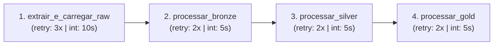

# 🏛️ ETL ITI - ICP-Brasil (Databricks Lakehouse & Asset Bundles)


> ⚠️ **Status do Projeto:** 🚧 **Em Desenvolvimento (*Work in Progress*)**  
> - **Fase 1 (Concluída):** Esteira de dados cadastrais e mestres das entidades ICP-Brasil (Extração, Normalização, PySpark Serverless, Modelagem Dimensional Star Schema e AI/BI Dashboard).  
> - **Fase 2 (Em Andamento - Silver Concluída):** Ingestão e ETL dos dados estatísticos do portal **ITI em Números** (volumetria agregada de emissões por UF, período, modalidade e infraestrutura). Camadas Raw, Bronze e Silver com histórico cumulativo (MERGE idempotente via SHA-256 e Liquid Clustering) implementadas; modelagem Gold e análises conversacionais via **Databricks Genie** em andamento.

---

## 📌 1. Contexto e Problema de Negócio

Os dados abertos disponibilizados pelo **Instituto Nacional de Tecnologia da Informação (ITI)** — autarquia federal vinculada à Casa Civil da Presidência da República — representam a espinha dorsal da Infraestrutura de Chaves Públicas Brasileira (**ICP-Brasil**). Eles documentam a árvore hierárquica e a rede física de Autoridades Certificadoras (ACs), Autoridades de Registro (ARs), Autoridades de Carimbo do Tempo (ACTs) e Prestadores de Serviço de Suporte (PSS), além dos dados estatísticos de emissão de certificados digitais no território nacional (**ITI em Números**).

Contudo, essas bases apresentam desafios analíticos significativos quando consumidas em seu estado bruto:
- **Alta Complexidade Hierárquica e Relacional:** As entidades compõem uma árvore de subordinação multinível (*AC Raiz ➔ ACs de 1º Nível ➔ ACs de 2º Nível ➔ ARs vinculadas*), exigindo algoritmos recursivos de desaninhamento estrutural (*flatten*) e consolidação de cadeia.
- **Heterogeneidade e Qualidade Cadastral:** Os dados brutos contêm registros desaninhados, atributos dispersos de endereçamento, CNPJs desformatados e necessidade de normalização geográfica por macrorregião.
- **Múltiplos Grãos Analíticos de Emissão:** Os indicadores estatísticos combinam séries temporais mensais globais, distribuições anuais por estado (UF), cortes de produto (A1, A3, etc.), meios de armazenamento (token, nuvem, equipamento) e KPIs agregados de cabeçalho.

**O Desafio Central:** Transformar esses fluxos heterogêneos de dados abertos em um **Lakehouse analítico moderno, confiável, auditável e preparado para escala**, viabilizando análises de governança, conformidade cadastral e cruzamento de oferta instalada versus demanda de mercado, suportados por painéis interativos de BI e inteligência conversacional (Genie).

### 🎯 Principais Desafios Técnicos

- Desaninhamento recursivo das estruturas JSON das APIs do ITI;
- Tratamento e normalização de dados cadastrais;
- Modelagem da hierarquia de ACs e ARs;
- Consolidação histórica dos indicadores do ITI em Números;
- Garantia de idempotência durante reprocessamentos;
- Integração entre dados cadastrais e estatísticos com diferentes granularidades;
- Execução local utilizando computação Serverless remota.

---

## 🧠 2. Decisões de Arquitetura e Racional de Execução

Antes da codificação, o projeto foi estruturado a partir de decisões arquiteturais pensadas para garantir desacoplamento, imutabilidade, escalabilidade e conformidade com as melhores práticas de Engenharia de Dados:

### 2.1. Ingestão e Imutabilidade (0_raw)
* **Decisão:** Manutenção de uma camada de armazenamento crua (*Landing / Raw*) persistida em **Volumes gerenciados do Unity Catalog**.
* **Racional:** Preservar o dado em sua forma mais fidedigna à fonte original (JSON bruto com timestamp de carga). Isso garante imutabilidade histórica, rastreabilidade ponta a ponta e a possibilidade de reprocessamento integral (*replay*) da esteira a partir do estado original sem gerar novas requisições às APIs públicas do governo.

### 2.2. Desacoplamento da Carga e Staging Analítico (1_bronze)
* **Decisão:** Materialização estruturada intermediária em formato Delta e persistência em CSV estruturado.
* **Racional:** Atua como área de *staging*, convertendo os dados desaninhados da *Raw* para formatos colunares com enriquecimento de metadados (`nome_arquivo`, `data_insercao`). Esse isolamento desacopla o gargalo de I/O da ingestão das transformações de negócio pesadas que ocorrem adiante.

### 2.3. Processamento Distribuído e Deduplicação (2_silver via PySpark & Delta MERGE)
* **Decisão:** Padronização e enriquecimento massivo utilizando **PySpark DataFrame API** e consolidação incremental via **MERGE idempotente**.
* **Racional:** Aproveitamento da computação distribuída nativa no Databricks. É a camada ideal para limpezas estruturais, formatação de CNPJs (`LPAD`), enriquecimento geográfico por macrorregiões, deduplicação por chave de negócio e resolução de séries históricas de estatísticas com surrogate keys SHA-256 (`CD_CHAVE_INDICADOR`), clusters Delta gerenciados por **Liquid Clustering** (`CLUSTER BY (DT_ANO, DS_FLAG)`).

### 2.4. Governança e Regras de Negócio Declarativas (3_gold via ANSI SQL)
* **Decisão:** Modelagem dimensional final e agregações expressas em **ANSI SQL** executadas via Databricks SQL Warehouse.
* **Racional:** Permite expressar regras de negócio, transformações relacionais e cálculos recursivos de cadeia hierárquica (`WITH RECURSIVE`) de maneira declarativa, padronizada e legível. A manutenibilidade, transparência e auditoria tornam-se simples para engenheiros de dados e analistas de BI.

### 2.5. Modelagem Analítica (Star Schema)
* **Decisão:** Modelagem dimensional clássica (Fatos e Dimensões).
* **Racional:** Segrega métricas de negócio quantitativas de atributos dimensionais descritivos. Essa arquitetura facilita consultas analíticas eficientes no BI, reduz o risco de dupla contagem decorrente da combinação de diferentes granularidades analíticas e torna simples a expansão do ecossistema com novos fatos sem impactar o esquema existente.

### 2.6. Infraestrutura e Orquestração como Código (Databricks Asset Bundles - DAB)
* **Decisão:** Gerenciamento declarativo via **Databricks Asset Bundles (DABs)**.
* **Racional:** Aplicação estrita de princípios de DataOps e DevOps. Workflows Jobs, tarefas em DAG com políticas automáticas de retry, ambientes (dev/prod), parâmetros e até o Dashboard analítico são versionados em Git e implantados via código declarativo, favorecendo consistência e reprodutibilidade entre ambientes.

### 2.7. Ciclo de Desenvolvimento Local e Seguro (Databricks Connect Serverless)
* **Decisão:** Desenvolvimento local acoplado ao **Databricks Connect** com computação **Serverless**.
* **Racional:** Permite que o desenvolvedor utilize sua IDE e ferramentas locais preferidas (VS Code, terminal, pytest) sem a necessidade de manter cópias locais de dados sensíveis ou clusters pesados locais. As chamadas Spark são despachadas remotamente e de forma autenticada, evitando a necessidade de armazenar credenciais diretamente no código-fonte.

---

## 🏛️ 3. Visão Geral da Arquitetura Medalhão

A arquitetura de dados segue o padrão **Medalhão** no **Databricks Lakehouse**, integrando os dados cadastrais das entidades e as séries estatísticas de números com governança centralizada no **Unity Catalog**:

```text
                  [ APIs Oficiais do ITI / ICP-Brasil ]
                 (Estrutura Organizacional & ITI em Números)
                                   │
                                   ▼ (Módulo de Extração & Flatten)
┌──────────────────────────────────────────────────────────────────────────────────┐
│ Camada 0_raw (Volumes do Unity Catalog)                                          │
│ ├── Volume: /Volumes/lakehouse_iti/0_raw/raw/entidades.json                      │
│ └── Volume: /Volumes/lakehouse_iti/0_raw/raw/numeros.json                        │
└─────────────────────────────────┬────────────────────────────────────────────────┘
                                   │
                                   ▼ (Conversão CSV & Statement Execution API / Databricks Jobs)
┌──────────────────────────────────────────────────────────────────────────────────┐
│ Camada 1_bronze (Volumes & Tabelas Delta)                                        │
│ ├── Volumes: entidades.csv / numeros.csv                                         │
│ ├── Tabela Delta: lakehouse_iti.1_bronze.entidades (com metadados e auditoria)   │
│ └── Tabela Delta: lakehouse_iti.1_bronze.numeros (dados estatísticos de emissão) │
└─────────────────────────────────┬────────────────────────────────────────────────┘
                                   │
                                   ▼ (Transformações, PySpark Serverless & MERGE Idempotente)
┌──────────────────────────────────────────────────────────────────────────────────┐
│ Camada 2_silver (Tabelas Delta Normalizadas, Enriquecidas & Séries Históricas)   │
│ ├── Tabela Delta: lakehouse_iti.2_silver.tbl_entidades                           │
│ ├── Tabela Delta: lakehouse_iti.2_silver.tbl_enderecos (com região e end. compl.)│
│ ├── Tabela Delta: lakehouse_iti.2_silver.tbl_hierarquia                          │
│ ├── Tabela Delta: lakehouse_iti.2_silver.stg_silver_numeros (staging tipado)     │
│ └── Tabela Delta: lakehouse_iti.2_silver.tbl_silver_numeros (Cluster By Ano/Flag)│
└─────────────────────────────────┬────────────────────────────────────────────────┘
                                   │
                                   ▼ (Modelagem Dimensional & Visões Analíticas)
┌──────────────────────────────────────────────────────────────────────────────────┐
│ Camada 3_gold (Tabelas Delta Dimensionais & Fatos de Consumo)                    │
│ ├── Dimensão: lakehouse_iti.3_gold.dim_entidade (enriquecida com região e audit.)│
│ ├── Dimensão: lakehouse_iti.3_gold.dim_hierarquia (árvore de subordinação)       │
│ └── Fato:     lakehouse_iti.3_gold.fato_metricas_entidades (métricas da cadeia)  │
└─────────────────────────────────┬────────────────────────────────────────────────┘
                                   │
                                   ▼ (Visualização Analítica & Tomada de Decisão)
┌──────────────────────────────────────────────────────────────────────────────────┐
│ Camada de BI & Analytics (Databricks AI/BI Lakeview Dashboard & Genie)           │
│ └── Painel: Painel de Entidades ITI (deploy declarativo via Databricks Bundle)   │
│     ├── KPIs, Rankings, Georreferenciamento e Séries Temporais                   │
│     └── Datasets Analíticos conectados diretamente às Tabelas Gold               │
└──────────────────────────────────────────────────────────────────────────────────┘
```

---

## 🗂️ 4. Estrutura de Diretórios do Projeto

A organização de diretórios e arquivos do repositório reflete a separação de responsabilidades e as diretrizes do Databricks Asset Bundle:

```text
etl-iti-icp-brasil/
├── .github/                             # Automações de Integração e Entrega Contínuas (CI/CD)
│   └── workflows/
│       └── python-cicd-implementacao.yml# Pipeline de validação estática, testes e deploy Databricks
│
├── .vscode/                             # Configurações de ambiente de desenvolvimento local
│   └── settings.json                    # Definições do interpretador e linters
│
├── docs/                                # Documentação técnica e relatórios visuais
│   └── dashboards/                      # Ativos visuais e relatórios do dashboard
│       ├── Painel de Entidades ITI.pdf  # Captura oficial em PDF exportada do Databricks
│       └── painel_entidades_iti_readme.png # Captura visual do painel incorporada na documentação
│
├── resources/                           # Definições declarativas de recursos no Databricks
│   ├── dashboards/                      # Especificações de dashboards (Lakeview / AI/BI)
│   │   └── Painel de Entidades ITI.lvdash.json # Definição declarativa do dashboard
│   ├── ITI_ICP_BRASIL_dashboard.yml     # Declaração do Dashboard AI/BI no Asset Bundle
│   └── ITI_ICP_BRASIL_job.yml           # Definição do Databricks Workflow Job (Serverless ETL)
│
├── src/                                 # Código-fonte principal da aplicação
│   ├── ITI_ICP_BRASIL/                  # Pacote Python para extração, tratamento e carga
│   │   ├── __init__.py                  # Inicialização do módulo Python
│   │   ├── __main__.py                  # Ponto de entrada para execução como módulo (python -m)
│   │   ├── main.py                      # Ponto de entrada de execução do pacote (CLI entrypoint)
│   │   ├── pipeline.py                  # Orquestração da pipeline modular fim a fim
│   │   ├── assets/                      # Módulo de comunicação e consumo de APIs externas
│   │   │   ├── __init__.py
│   │   │   └── url_iti.py               # Extração de dados da API oficial de entidades e números
│   │   ├── processamento/               # Módulo de transformação e normalização de dados
│   │   │   ├── __init__.py
│   │   │   └── flatten.py               # Algoritmo de desaninhamento recursivo de estruturas JSON
│   │   ├── exportacao/                  # Módulo de carga e persistência de dados
│   │   │   ├── __init__.py
│   │   │   ├── upload_raw.py            # Upload de dados brutos (JSON) para Volumes Raw
│   │   │   ├── upload_bronze.py         # Conversão para CSV, upload no Volume Bronze e Tabelas Delta
│   │   │   ├── upload_silver.py         # Pipeline Silver com PySpark DataFrame API & Delta MERGE
│   │   │   └── upload_gold.py           # Modelagem e carga da camada Gold (dimensões e fatos)
│   │   └── config/                      # Configurações gerais e parâmetros de ambiente
│   │       ├── __init__.py
│   │       ├── config.py                # Definição de endpoints, volumes, tabelas e warehouse_id
│   │       ├── glossario.py             # Dicionários de termos, flags analíticas e dimensões temporais
│   │       └── logger.py                # Utilitário centralizado de logging com formatação visual
│
├── tests/                               # Suíte de testes automatizados
│   ├── conftest.py                      # Configurações globais e fixtures do pytest (Spark/Connect)
│   ├── test_logger.py                   # Testes unitários do sistema de logging
│   └── test_package.py                  # Testes unitários de importação e integridade do pacote
│
├── databricks.yml                       # Configuração declarativa do Databricks Asset Bundle (DAB)
├── pyproject.toml                       # Especificação do projeto e gerenciamento de dependências
├── uv.lock                              # Registro determinístico de versões de dependências
├── .gitignore                           # Regras de exclusão de arquivos no controle de versão
└── README.md                            # Documentação técnica principal do projeto
```

---

## 🛠️ 5. Tecnologias e Especificações Técnicas

Com base nas decisões de arquitetura, o projeto foi implementado utilizando padrões modernos de Engenharia de Dados em Nuvem:

- **Plataforma e Orquestração:** [Databricks Asset Bundles (DABs)](https://docs.databricks.com/dev-tools/bundles/index.html) e [Databricks Workflows](https://docs.databricks.com/workflows/index.html)
- **Motor de Computação Distribuída:** Apache Spark / PySpark & Delta Lake (Serverless Compute)
- **Execução Local Remota:** [Databricks Connect](https://docs.databricks.com/dev-tools/databricks-connect/python/index.html) acoplado a Serverless (`DatabricksSession.builder.serverless(True)`)
- **Armazenamento e Governança:** Databricks Unity Catalog (`Volumes` gerenciados, Tabelas Delta com Liquid Clustering)
- **SDK de Integração:** [Databricks SDK para Python](https://docs.databricks.com/dev-tools/sdk-python.html) (`WorkspaceClient`, `StatementExecutionAPI`, `VolumesAPI`, `FilesAPI`) com fallback resiliente de SQL Warehouse
- **Modelagem Analítica:** Star Schema (Dimensões, Fato com CTE Recursiva e Séries Históricas com surrogate key SHA-256)
- **Gerenciador de Dependências:** [Astral uv](https://docs.astral.sh/uv/) e [Hatchling](https://hatch.pypa.io/)
- **Análise Estática e Linter:** [Ruff](https://astral.sh/ruff)
- **Testes Automatizados:** [pytest](https://docs.pytest.org/) com fixtures desacopladas
- **CI/CD:** GitHub Actions com validação de linters, testes e deploy automatizado do bundle

---

## 🚀 6. Guia de Instalação e Configuração do Ambiente

### 6.1. Pré-requisitos
- **Interpretador Python:** Versão `>=3.10, <3.13`
- **Gerenciador UV:** [Documentação de Instalação do UV](https://docs.astral.sh/uv/getting-started/installation/)
- **Databricks CLI:** [Documentação de Instalação da Databricks CLI v0.200+](https://docs.databricks.com/dev-tools/cli/databricks-cli.html)

### 6.2. Inicialização do Ambiente Virtual

Execute a sincronização determinística do ambiente e instalação de dependências de desenvolvimento:

```bash
uv sync --dev
```

### 6.3. Autenticação no Databricks

Configure as credenciais do Databricks no seu arquivo `~/.databrickscfg` ou utilize o comando da CLI:

```bash
databricks auth login --host https://<seu-workspace-id>.cloud.databricks.com
```

---

## ⚙️ 7. Execução da Pipeline de ETL

O fluxo completo de ponta a ponta (Raw ➔ Bronze ➔ Silver ➔ Gold) é orquestrado de forma modular e pode ser executado unificadamente através do ponto de entrada principal do projeto:

### 7.1. Execução Fim a Fim e Modular

```bash
# Execução da esteira completa de ponta a ponta
uv run main
# ou
python -m ITI_ICP_BRASIL

# Execução direcionada de etapas individuais (scripts registrados no pyproject.toml)
uv run run_raw      # Extração das APIs do ITI e carga nos Volumes Raw
uv run run_bronze   # Conversão para CSV e tabelas Delta Bronze
uv run run_silver   # Padronização e tabelas Delta Silver via PySpark Serverless e Delta MERGE
uv run run_gold     # Dimensões e fatos Gold via SQL Warehouse
```

### 7.2. Etapas Executadas pela Pipeline Modular

Ao ser executada, a função `pipeline()` em [src/ITI_ICP_BRASIL/pipeline.py](src/ITI_ICP_BRASIL/pipeline.py) orquestra sequencialmente as seguintes etapas:

| Ordem | Etapa / Função | Camada | Descrição Técnica |
| :---: | :--- | :---: | :--- |
| **1** | `upload_volume_iti_entidades()` | **0_raw** | Extrai dados da API de entidades e salva `entidades.json` no Volume Raw do Unity Catalog. |
| **2** | `upload_volume_iti_numeros()` | **0_raw** | Extrai dados da API estatística e salva `numeros.json` no Volume Raw do Unity Catalog. |
| **3** | `upload_volume_bronze_iti_entidades()` | **1_bronze** | Converte JSON de entidades para CSV e persiste no Volume Bronze (`/Volumes/.../entidades.csv`). |
| **4** | `upload_volume_bronze_iti_numeros()` | **1_bronze** | Converte JSON de números para CSV e persiste no Volume Bronze (`/Volumes/.../numeros.csv`). |
| **5** | `upload_tabela_bronze_iti_entidades()` | **1_bronze** | Cria/atualiza tabela Delta `lakehouse_iti.1_bronze.entidades` com metadados e auditoria. |
| **6** | `upload_tabela_bronze_iti_numeros()` | **1_bronze** | Cria/atualiza tabela Delta `lakehouse_iti.1_bronze.numeros` com métricas estatísticas brutas. |
| **7** | `upload_silver_entidades()` | **2_silver** | Processa via PySpark Serverless `lakehouse_iti.2_silver.tbl_entidades` com limpeza de CNPJ. |
| **8** | `upload_silver_enderecos()` | **2_silver** | Processa via PySpark Serverless `lakehouse_iti.2_silver.tbl_enderecos` com enriquecimento de macrorregião. |
| **9** | `upload_silver_hierarquia()` | **2_silver** | Processa via PySpark Serverless `lakehouse_iti.2_silver.tbl_hierarquia` explodindo ancestrais (`ids_pai`). |
| **10** | `create_tabela_silver_numeros()` | **2_silver** | Cria a tabela mestre Delta `lakehouse_iti.2_silver.tbl_silver_numeros` com Liquid Clustering por Ano e Flag. |
| **11** | `upload_staging_silver_numeros()` | **2_silver** | Efetua casting, enriquecimento via `glossario.py` e grava `lakehouse_iti.2_silver.stg_silver_numeros`. |
| **12** | `merge_tabela_silver_numeros()` | **2_silver** | Executa `MERGE` idempotente via surrogate key SHA-256 (`CD_CHAVE_INDICADOR`) acumulando séries históricas. |
| **13** | `upload_gold_entidades()` | **3_gold** | Cria a tabela dimensional `lakehouse_iti.3_gold.dim_entidade` com visão 360º e granularidade geográfica. |
| **14** | `upload_gold_hierarquia()` | **3_gold** | Cria a tabela dimensional de subordinação `lakehouse_iti.3_gold.dim_hierarquia`. |
| **15** | `upload_gold_metricas_entidades()` | **3_gold** | Cria a tabela fato `lakehouse_iti.3_gold.fato_metricas_entidades` via CTE recursiva consolidando a cadeia. |

### 7.3. Modelagem e Tabelas Geradas por Camada

- **Camada 1_bronze**:
  - `lakehouse_iti.1_bronze.entidades`: Dados cadastrais brutos estruturados com metadados adicionais (`nome_arquivo`, `data_insercao`).
  - `lakehouse_iti.1_bronze.numeros`: Dados estatísticos brutos de emissão desaninhados via `flatten_num` com indicadores, índices e contagens.
- **Camada 2_silver** (PySpark, Databricks Connect Serverless & Delta MERGE):
  - `lakehouse_iti.2_silver.tbl_entidades`: Entidades limpas, CNPJ formatado (`LPAD` de 14 dígitos), `data_credenciamento` tipada, situação normalizada e deduplicação por chave primária (`id_entidade`).
  - `lakehouse_iti.2_silver.tbl_enderecos`: Endereços normalizados com campo consolidado `endereco_completo`, enriquecimento de `regiao` (Sudeste, Sul, Nordeste, Centro-Oeste, Norte via UF) e tolerância de casting via `try_cast`.
  - `lakehouse_iti.2_silver.tbl_hierarquia`: Relações hierárquicas entre entidades (`id_entidade`, `id_entidade_pai`, `nivel_hierarquia_filho`).
  - `lakehouse_iti.2_silver.stg_silver_numeros`: Staging tipado dos números com enriquecimento de termos e flags analíticas via `glossario.py` e normalização de datas.
  - `lakehouse_iti.2_silver.tbl_silver_numeros`: Tabela mestre consolidada via `MERGE` idempotente com surrogate key SHA-256 (`CD_CHAVE_INDICADOR`), histórico cumulativo plurianual e Liquid Clustering por `(DT_ANO, DS_FLAG)`.
- **Camada 3_gold** (Modelagem Dimensional Star Schema):
  - `lakehouse_iti.3_gold.dim_entidade`: Dimensão consolidada com endereço completo, granularidade geográfica (`SG_UF`, `DS_REGIAO`, `NM_CIDADE`, `NM_BAIRRO`, `NR_CEP`), credenciamento e auditoria (`DT_CARGA_DW`).
  - `lakehouse_iti.3_gold.dim_hierarquia`: Dimensão com relações de subordinação direta entre entidades (`ID_ENTIDADE_PAI`, `ID_ENTIDADE`, `DS_NIVEL`).
  - `lakehouse_iti.3_gold.fato_metricas_entidades`: Fato gerencial calculada via **CTE Recursiva** (`WITH RECURSIVE hierarquia_completa`), agregando métricas da cadeia completa:
    - `NR_AGREGADOS_AC_NIVEL_1`: Quantidade de ACs de 1º Nível subordinadas.
    - `NR_AGREGADOS_AC_NIVEL_2`: Quantidade de ACs de 2º Nível subordinadas.
    - `NR_AGREGADOS_AR`: Quantidade total de ARs na cadeia consolidada para cada autoridade.
    - `DT_CARGA_DW`: Timestamp de auditoria da carga.

### 7.4. Execução Modular / Programática

Como cada camada é implementada como uma função desacoplada, etapas isoladas podem ser importadas e acionadas sob demanda via scripts Python ou notebooks:

```python
from ITI_ICP_BRASIL.exportacao.upload_silver import merge_tabela_silver_numeros

# Execução direcionada de uma etapa isolada
merge_tabela_silver_numeros()
```

### 7.5. Comandos do Databricks Asset Bundle (DAB)

```bash
# Validação sintática das configurações e declarações do bundle
databricks bundle validate

# Deploy em ambiente de desenvolvimento (dev)
databricks bundle deploy

# Deploy em ambiente de produção (prod)
databricks bundle deploy --target prod

# Execução do Workflow Job gerenciado no Databricks (Serverless)
databricks bundle run ITI_ICP_BRASIL_job
```

#### 7.5.1. Arquitetura da DAG de Tarefas no Databricks Workflows

O job gerenciado no Databricks opera como um Grafo Acíclico Dirigido (DAG) modularizado em 4 tarefas encadeadas com políticas automáticas de **retry** para máxima resiliência:



- **Isolamento de Falhas:** Caso ocorra instabilidade temporária na API externa do ITI, apenas a tarefa `extrair_e_carregar_raw` é reexecutada (até 3 tentativas).
- **Eficiência Computacional:** Se houver erro em uma camada posterior, o Databricks refaz apenas a tarefa impactada, preservando os dados já processados nas camadas anteriores.
- **Agendamento Automático (*Cron Schedule*):** O job é programado para execução diária às **08:00 (Horário de Brasília — `America/Sao_Paulo`)**, operando de forma autônoma no ambiente de Produção.

---

## 📊 8. Painel de Visualização & Analytics (Databricks AI/BI Dashboard)

O projeto inclui o painel analítico oficial **Painel de Entidades ITI**, implementado no **Databricks AI/BI Lakeview** e versionado como código declarativo (`resources/dashboards/Painel de Entidades ITI.lvdash.json`) integrado diretamente ao Databricks Asset Bundle (`resources/ITI_ICP_BRASIL_dashboard.yml`).


### 8.1. Datasets e Rastreabilidade com as Tabelas Gold

O dashboard consome diretamente a modelagem dimensional criada na Camada 3_gold do Lakehouse:

| Dataset no Dashboard | Tabela Gold Origem | Tipo de Consulta / Agregação |
| :--- | :--- | :--- |
| `dim_entidade` *(Metric View)* | `lakehouse_iti.3_gold.dim_entidade` | Métricas agregadas e filtros globais (`SG_UF`, `DS_REGIAO`, `DS_TIPO`, `DS_SITUACAO`). |
| `top_ufs` | `lakehouse_iti.3_gold.dim_entidade` | Agrupamento por `SG_UF` com ordenação decrescente (Top 10). |
| `top_agregados` | `lakehouse_iti.3_gold.fato_metricas_entidades` | CTE analítica somando métricas de agregação por autoridade. |
| `evolucao` | `lakehouse_iti.3_gold.dim_entidade` | Série temporal agrupada por `YEAR(DT_CREDENCIAMENTO)` e `DS_TIPO`. |
| `agregados_regiao` | `lakehouse_iti.3_gold.dim_entidade` | Distribuição categórica cruzada por macrorregião geográfica. |
| `hierarquia` | `lakehouse_iti.3_gold.dim_hierarquia` + `dim_entidade` | Self-join relacional entre ancestrais e subordinados diretos. |

### 8.2. Deploy Declarativo do Dashboard via Databricks Asset Bundle (DAB)

O dashboard é gerenciado como código (*Dashboard-as-Code*) através do arquivo declarativo [`resources/ITI_ICP_BRASIL_dashboard.yml`](resources/ITI_ICP_BRASIL_dashboard.yml). Ao executar o deploy do bundle, o dashboard é provisionado e vinculado automaticamente ao SQL Warehouse do workspace:

```bash
# Valida a integridade da pipeline e do dashboard
databricks bundle validate

# Deploy do Workflow Job e do Dashboard no Databricks
databricks bundle deploy
```

---

## 📈 9. Resultados e Entregas do Sistema

Mais do que a execução de scripts de ETL, a solução entrega uma infraestrutura analítica completa, auditável e orientada a dados:

- **+11.200 Registros Brutos** processados, normalizados e catalogados com linhagem clara.
- **+11.000 Entidades da ICP-Brasil** mapeadas em árvore de subordinação hierárquica completa.
- **Tabelas Delta gerenciadas** nas camadas Bronze, Silver e Gold, com governança no Unity Catalog e suporte a **Liquid Clustering** (`CLUSTER BY (DT_ANO, DS_FLAG)`).
- **Consolidação Histórica Idempotente** via chave surrogate SHA-256 (`CD_CHAVE_INDICADOR`), permitindo reprocessamentos sem duplicidades ou colisões.
- **4 Camadas Ativas** no Lakehouse (0_raw ➔ 1_bronze ➔ 2_silver ➔ 3_gold), com governança centralizada no Unity Catalog.
- **Orquestração Autônoma em Produção** via Databricks Workflows com agendamento diário e políticas automáticas de retry.
- **Dashboard Executivo AI/BI Lakeview** gerenciado como código e integrado ao Asset Bundle.
- **Pipeline Modular**, permitindo execução e depuração isolada de qualquer função via CLI ou código.
- **Suíte de Testes Automatizados** cobrindo integridade de esquema, logging e comportamento de pacote.
- **Deploy Declarativo e Reproduzível** via Databricks Asset Bundles (DAB).

---

## 🧪 10. Qualidade de Software e Testes Automatizados

Para garantir confiabilidade, manutenibilidade e conformidade contínua:

```bash
# Execução da suíte de testes unitários
uv run pytest

# Execução do linter e verificação de boas práticas (Ruff)
uv run ruff check .

# Aplicação de correções e formatação automática
uv run ruff format .

# Validação declarativa do bundle Databricks
databricks bundle validate
```

---

## 🤖 11. Uso de Inteligência Artificial no Desenvolvimento

Este projeto utilizou ferramentas de Inteligência Artificial de forma colaborativa no ciclo de engenharia de software, com foco em:
- Revisão de padrões arquiteturais e boas práticas de código Python/Spark;
- Estruturação e refinamento de testes unitários automatizados;
- Elaboração de documentação técnica dinâmica e geração de diagramas conceituais;
- Aceleração de tarefas repetitivas, análise de logs e diagnósticos de erros de execução.

> 🛡️ **Nota de Governança e Autoria:** As decisões arquiteturais, o desenho da modelagem dimensional (Star Schema), a concepção do hash surrogate SHA-256, a estratégia de particionamento/clustering e a validação técnica de cada camada foram concebidas, decididas e auditadas pelo autor do projeto.

---

## 🗺️ 12. Roadmap de Evolução: ITI em Números & Databricks Genie

A esteira implementada consolida a base mestra cadastral e o histórico analítico de emissões:

1. **Ingestão e Consolidação Histórica de Estatísticas (*ITI em Números*) — [Concluída na Silver]:**
   - Esteira completa de ingestão (Raw e Bronze) e consolidação na Silver (`tbl_silver_numeros`) com resolução de chaves SHA-256 e categorização padronizada por flags canônicas de negócio (`cer`, `reg`, `dis`, `inf`).
   - *Nota de Governança:* Em conformidade com as diretrizes concorrenciais e estratégicas do ITI, os dados de emissão disponibilizados são estatísticos e agregados territorialmente, preservando o sigilo comercial das emissões individuais por AC/AR específica.

2. **Modelagem Dimensional Gold de Emissões & Cruzamento Oferta vs. Demanda — [Em Desenvolvimento]:**
   - Criação das tabelas fato especializadas na Camada Gold (`fato_emissao_mensal`, `fato_distribuicao_geografica`, `fato_segmentacao_certificados`, `fato_infraestrutura_credenciamento` e `kpi_resumo_executivo`).
   - Cruzamento analítico das séries de emissão com a infraestrutura credenciada (`dim_entidade` e `dim_hierarquia`):
     - Densidade de autoridades credenciadas vs. volume demandado de certificados por estado.
     - Identificação de regiões com alta demanda e potencial desassistência de pontos de atendimento (ARs).

3. **Analytics Conversacional com Databricks Genie (AI/BI):**
   - Criação de um **Genie Space** conectado às tabelas dimensionais e métricas no Unity Catalog, habilitando que analistas realizem levantamentos estatísticos, análises exploratórias e geração de insights através de linguagem natural (e.g., *"Qual o crescimento anual de certificados A1 na Região Sudeste em comparação com o total de ARs ativas?"*).
