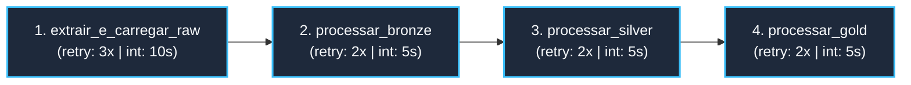
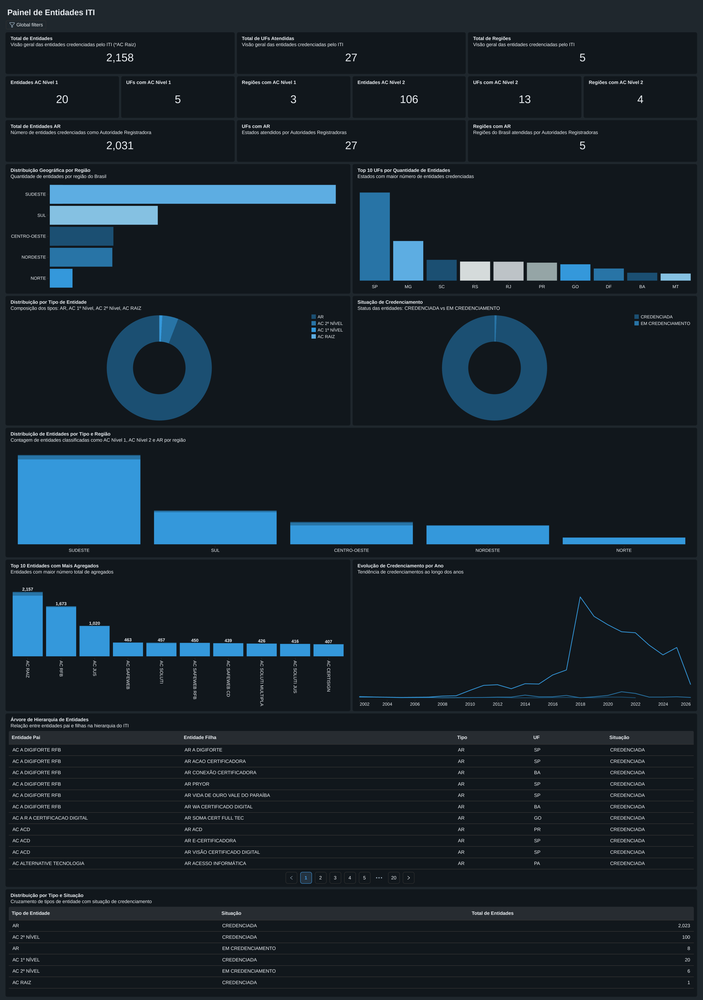

# 🏛️ ETL ITI - ICP-Brasil (Databricks Lakehouse, Asset Bundles & AI Genie)


> 🚀 **Status do Projeto:** ✅ **Pipeline Validado de Ponta a Ponta e 100% Operacional**  
> - **Fase 1 (Concluída):** Esteira cadastral e mestre de entidades ICP-Brasil (Extração de APIs, desaninhamento estrutural, PySpark Serverless, Modelagem Dimensional Star Schema e AI/BI Dashboard Lakeview).  
> - **Fase 2 (Concluída):** Ingestão e ETL analítico do portal **ITI em Números** (volumetria agregada de emissões por UF, período, modalidade e credenciamento), consolidação plurianual idempotente via surrogate key SHA-256 e tabelas analíticas Gold otimizadas via *Liquid Clustering*.  
> - **Fase 3 (Concluída):** Analytics conversacional via **Databricks Genie Space** (`Genie - Inteligência Analítica ICP-Brasil`), conectado às 9 tabelas Gold, regras semânticas calibradas no Unity Catalog e módulo de inteligência de mercado com 5 fontes setoriais externas (ANCD, Crypto ID, ABRID, AR Federal, Convergência Digital) e UDF de IA registrada no catálogo.

---

## 📌 1. Contexto e Problema de Negócio

Os dados abertos disponibilizados pelo **Instituto Nacional de Tecnologia da Informação (ITI)** — autarquia federal vinculada à Casa Civil da Presidência da República — representam a espinha dorsal da Infraestrutura de Chaves Públicas Brasileira (**ICP-Brasil**). Eles documentam a árvore hierárquica e a rede física de Autoridades Certificadoras (ACs), Autoridades de Registro (ARs), Autoridades de Carimbo do Tempo (ACTs) e Prestadores de Serviço de Suporte (PSS), além dos dados estatísticos de emissão de certificados digitais no território nacional (**ITI em Números**).

Contudo, essas bases apresentam desafios analíticos significativos quando consumidas em seu estado bruto:
- **Alta Complexidade Hierárquica e Relacional:** As entidades compõem uma árvore de subordinação multinível (*AC Raiz ➔ ACs de 1º Nível ➔ ACs de 2º Nível ➔ ARs vinculadas*), exigindo algoritmos recursivos de desaninhamento estrutural (*flatten*) e consolidação de cadeia.
- **Heterogeneidade e Qualidade Cadastral:** Os dados brutos contêm registros desaninhados, atributos dispersos de endereçamento, CNPJs desformatados e necessidade de normalização geográfica por macrorregião.
- **Múltiplos Grãos Analíticos de Emissão:** Os indicadores estatísticos combinam séries temporais mensais globais, distribuições anuais por estado (UF), cortes de produto (A1, A3, etc.), meios de armazenamento (token, nuvem, equipamento) e KPIs agregados de cabeçalho.
- **Dispersão da Inteligência Setorial:** Notícias, marcos regulatórios e movimentações de mercado ficam dispersos em múltiplos portais e associações da certificação digital, sem correlação direta com os dados analíticos do Lakehouse.

**O Desafio Central:** Transformar esses fluxos heterogêneos de dados abertos em um **Lakehouse analítico moderno, confiável, auditável e preparado para escala**, viabilizando análises de governança, conformidade cadastral e cruzamento de oferta instalada versus demanda de mercado, suportados por painéis interativos de BI e inteligência conversacional (Genie).

### 🎯 Principais Desafios Técnicos Superados

- Desaninhamento recursivo das estruturas JSON das APIs do ITI;
- Tratamento e normalização de dados cadastrais com enriquecimento geográfico;
- Modelagem recursiva da hierarquia de subordinação de ACs e ARs;
- Consolidação histórica dos indicadores do ITI em Números com tolerância a reprocessamento;
- Garantia de idempotência durante reprocessamentos via chave hash SHA2-256;
- Integração entre dados cadastrais e estatísticos com diferentes granularidades analíticas;
- Módulo de inteligência externa com web scraping e ingestão resiliente de feeds RSS de 5 portais setoriais;
- Integração do Databricks Genie com governança semântica completa e UDF de IA no Unity Catalog;
- Execução local utilizando computação Serverless remota via Databricks Connect.

---

## 🧠 2. Decisões de Arquitetura e Racional de Execução

Antes da codificação, o projeto foi estruturado a partir de decisões arquiteturais pensadas para garantir desacoplamento, imutabilidade, escalabilidade e conformidade com as melhores práticas de Engenharia de Dados:

### 2.1. Ingestão e Imutabilidade (0_raw)
* **Decisão:** Manutenção de uma camada de armazenamento crua (*Landing / Raw*) persistida em **Volumes gerenciados do Unity Catalog**.
* **Racional:** Preservar o dado em sua forma mais fidedigna à fonte original (JSON bruto com timestamp de carga). Isso garante imutabilidade histórica, rastreabilidade ponta a ponta e a possibilidade de reprocessamento integral (*replay*) da esteira a partir do estado original sem gerar novas requisições às APIs públicas do governo.

### 2.2. Desacoplamento da Carga e Staging Analítico (1_bronze)
* **Decisão:** Materialização estruturada intermediária em formato Delta e persistência em CSV estruturado.
* **Racional:** Atua como área de *staging*, convertendo os dados desaninhados da *Raw* para formatos colunares com enriquecimento de metadados (`nome_arquivo`, `data_insercao`). Esse isolamento desacopla o gargalo de I/O da ingestão das transformações de negócio pesadas que ocorrem adiante.

### 2.3. Processamento Distribuído e Deduplicação (2_silver via PySpark & Delta MERGE)
* **Decisão:** Padronização e enriquecimento massivo utilizando **PySpark DataFrame API** e consolidação incremental via **MERGE idempotente**.
* **Racional:** Aproveitamento da computação distribuída nativa no Databricks. É a camada ideal para limpezas estruturais, formatação de CNPJs (`LPAD`), enriquecimento geográfico por macrorregiões, deduplicação por chave de negócio e resolução de séries históricas de estatísticas com surrogate keys SHA-256 (`CD_CHAVE_INDICADOR`), clusters Delta gerenciados por **Liquid Clustering** (`CLUSTER BY (DT_ANO, DS_FLAG)`).

### 2.4. Governança e Regras de Negócio Declarativas (3_gold via ANSI SQL)
* **Decisão:** Modelagem dimensional final e agregações expressas em **ANSI SQL** executadas via Databricks SQL Warehouse com helper resiliente (`executar_statement_delta`).
* **Racional:** Permite expressar regras de negócio, transformações relacionais e cálculos recursivos de cadeia hierárquica (`WITH RECURSIVE`) de maneira declarativa, padronizada e legível. A manutenibilidade, transparência e auditoria tornam-se simples para engenheiros de dados e analistas de BI.

### 2.5. Modelagem Analítica (Star Schema)
* **Decisão:** Modelagem dimensional clássica (Fatos e Dimensões).
* **Racional:** Segrega métricas de negócio quantitativas de atributos dimensionais descritivos. Essa arquitetura facilita consultas analíticas eficientes no BI, reduz o risco de dupla contagem decorrente da combinação de diferentes granularidades analíticas e torna simples a expansão do ecossistema com novos fatos sem impactar o esquema existente.

### 2.6. Módulo de Inteligência Externa (Padrão Strategy / Plugin)
* **Decisão:** Coleta declarativa de notícias e regulamentações setoriais externas com enriquecimento e carga idempotente na tabela `dim_inteligencia_mercado`.
* **Racional:** Complementa as métricas quantitativas com dados qualitativos de mercado. Construído sob um padrão plugável (`FONTES_INTELIGENCIA`), permitindo plugar facilmente novos portais de notícias, blogs de ACs/ARs ou cotações de preços sem alterar a esteira principal do ITI.

### 2.7. Analytics Conversacional com Databricks Genie & UDF de IA
* **Decisão:** Disponibilização de um espaço semântico no **Databricks Genie** (`Genie - Inteligência Analítica ICP-Brasil`), integrado com 38 comentários analíticos em catálogo e uma UDF de IA (`fn_consultar_inteligencia_setorial`).
* **Racional:** Habilita consultas analíticas em linguagem natural direta para tomadores de decisão e executivos sem exigir conhecimento prévio da sintaxe SQL ou do modelo de dados interno.

### 2.8. Infraestrutura e Orquestração como Código (Databricks Asset Bundles - DAB)
* **Decisão:** Gerenciamento declarativo via **Databricks Asset Bundles (DABs)**.
* **Racional:** Aplicação estrita de princípios de DataOps e DevOps. Workflows Jobs, tarefas em DAG com políticas automáticas de retry, ambientes (dev/prod), parâmetros e o Dashboard analítico são versionados em Git e implantados via código declarativo, favorecendo consistência e reprodutibilidade entre ambientes.

### 2.9. Ciclo de Desenvolvimento Local e Seguro (Databricks Connect Serverless)
* **Decisão:** Desenvolvimento local acoplado ao **Databricks Connect** com computação **Serverless**.
* **Racional:** Permite que o desenvolvedor utilize sua IDE e ferramentas locais preferidas (VS Code, terminal, pytest) sem a necessidade de manter cópias locais de dados sensíveis ou clusters pesados locais. As chamadas Spark são despachadas remotamente e de forma autenticada.

---

## 🏛️ 3. Visão Geral da Arquitetura Medalhão

A arquitetura de dados segue o padrão **Medalhão** no **Databricks Lakehouse**, integrando os dados cadastrais das entidades, as séries estatísticas de números e a inteligência de mercado com governança centralizada no **Unity Catalog**:

```text
       [ APIs Oficiais ITI ]                     [ Portais e Feeds Setoriais ]
   (Entidades & ITI em Números)              (ANCD, Crypto ID, ABRID, AR Fed, ConvDig)
                │                                                │
                ▼                                                ▼
     (Extração & Desaninhamento)                      (Web Scraping & Parsing RSS)
┌──────────────────────────────────────────┐                     │
│ Camada 0_raw (Volumes Unity Catalog)     │                     │
│ ├── /Volumes/.../raw/entidades.json      │                     │
│ └── /Volumes/.../raw/numeros.json        │                     │
└───────────────────┬──────────────────────┘                     │
                    │                                            │
                    ▼                                            │
        (Conversão CSV & Tabelas)                                │
┌──────────────────────────────────────────┐                     │
│ Camada 1_bronze (Volumes & Delta Bruto)  │                     │
│ ├── Volumes: entidades.csv / numeros.csv │                     │
│ ├── Tabela Delta: 1_bronze.entidades     │                     │
│ └── Tabela Delta: 1_bronze.numeros       │                     │
└───────────────────┬──────────────────────┘                     │
                    │                                            │
                    ▼                                            │
       (PySpark Serverless & MERGE)                              │
┌──────────────────────────────────────────┐                     │
│ Camada 2_silver (Tabelas Delta Limpas)   │                     │
│ ├── 2_silver.tbl_entidades               │                     │
│ ├── 2_silver.tbl_enderecos (regiões)     │                     │
│ ├── 2_silver.tbl_hierarquia (cadeia)     │                     │
│ ├── 2_silver.stg_silver_numeros          │                     │
│ └── 2_silver.tbl_silver_numeros (SHA256) │                     │
└───────────────────┬──────────────────────┘                     │
                    │                                            │
                    ▼                                            │
       (Modelagem Dimensional Star Schema & MERGE Idempotente) ◀┘
┌─────────────────────────────────────────────────────────────────────────┐
│ Camada 3_gold (Tabelas Delta Otimizadas com Liquid Clustering)          │
│ ├── Dimensão:    lakehouse_iti.3_gold.dim_entidade                      │
│ ├── Dimensão:    lakehouse_iti.3_gold.dim_hierarquia                    │
│ ├── Dimensão:    lakehouse_iti.3_gold.dim_inteligencia_mercado          │
│ ├── Fato Cadeia: lakehouse_iti.3_gold.fato_metricas_entidades (CTE)     │
│ ├── Fato Séries: lakehouse_iti.3_gold.fato_emissao_mensal               │
│ ├── Fato Mapa:   lakehouse_iti.3_gold.fato_distribuicao_geografica      │
│ ├── Fato Corte:  lakehouse_iti.3_gold.fato_segmentacao_certificados     │
│ ├── Fato Infra:  lakehouse_iti.3_gold.fato_infraestrutura_credenciamento│
│ └── KPI Resumo:  lakehouse_iti.3_gold.kpi_resumo_executivo              │
└───────────────────────────────────┬─────────────────────────────────────┘
                                    │
                    ┌───────────────┴───────────────┐
                    ▼                               ▼
┌──────────────────────────────────────┐  ┌──────────────────────────────────────┐
│ Databricks AI/BI Lakeview Dashboard  │  │ Databricks Genie Space (AI Assistant)│
│ ├── Deploy declarativo via Bundle    │  │ ├── 9 Tabelas Gold conectadas        │
│ ├── Rankings, Mapas e Séries         │  │ ├── 38 Comentários Semânticos no UC  │
│ └── Métricas estratégicas de negócio │  │ └── Tool UDF: fn_consultar_intel...  │
└──────────────────────────────────────┘  └──────────────────────────────────────┘
```

---

## 🗂️ 4. Estrutura de Diretórios do Projeto

A organização do repositório reflete a separação de responsabilidades, arquitetura modular e diretrizes de DataOps:

```text
etl-iti-icp-brasil/
├── .github/                             # Automações de Integração e Entrega Contínuas (CI/CD)
│   └── workflows/
│       └── python-cicd-implementacao.yml# Pipeline de validação estática, testes e deploy Databricks
│
├── .vscode/                             # Configurações de ambiente de desenvolvimento local
│   └── settings.json                    # Definições do interpretador e linters
│
├── docs/                                # Documentação técnica e relatórios visuais
│   └── dashboards/                      # Ativos visuais e relatórios do dashboard
│       ├── Painel de Entidades ITI.pdf  # Captura oficial em PDF exportada do Databricks
│       └── painel_entidades_iti_readme.png # Captura visual do painel incorporada na documentação
│
├── resources/                           # Definições declarativas de recursos no Databricks (DABs)
│   ├── dashboards/                      # Especificações de dashboards (Lakeview / AI/BI)
│   │   └── Painel de Entidades ITI.lvdash.json # Definição declarativa do dashboard
│   ├── genie/                           # Módulo completo do Databricks Genie Space
│   │   ├── config/                      # Especificações declarativas do espaço
│   │   │   ├── ITI_ICP_BRASIL_genie.yml # Declaração YAML do Genie Space
│   │   │   └── genie_space_definition.json # Payload JSON completo da API Genie
│   │   ├── docs/                        # Regras semânticas e glossário de negócio
│   │   │   └── REGRAS_NEGOCIO_GENIE.md  # Instruções, prompts canônicos e padrões de filtro
│   │   ├── scripts/                     # Automações de deploy e governança
│   │   │   ├── deploy_genie.py          # Script de provisionamento idempotente do Genie
│   │   │   └── apply_comments.py        # Aplicação dos 38 comentários semânticos via SQL
│   │   ├── sql/                         # Scripts DDL de governança semântica
│   │   │   └── comments_gold_genie.sql  # Comentários catalogados de tabelas e colunas Gold
│   │   └── README.md                    # Guia operacional exclusivo do módulo Genie
│   ├── ITI_ICP_BRASIL_dashboard.yml     # Declaração do Dashboard AI/BI no Asset Bundle
│   └── ITI_ICP_BRASIL_job.yml           # Definição do Databricks Workflow Job (Serverless ETL)
│
├── src/                                 # Código-fonte principal da aplicação
│   └── ITI_ICP_BRASIL/                  # Pacote Python para extração, tratamento e carga
│       ├── __init__.py                  # Inicialização do módulo Python
│       ├── __main__.py                  # Ponto de entrada para execução como módulo (python -m)
│       ├── main.py                      # Ponto de entrada de execução do pacote (CLI entrypoint)
│       ├── pipeline.py                  # Orquestração da pipeline modular fim a fim
│       ├── assets/                      # Módulo de comunicação e consumo de APIs externas
│       │   ├── __init__.py
│       │   └── url_iti.py               # Extração de dados da API oficial de entidades e números
│       ├── processamento/               # Módulo de transformação e normalização de dados
│       │   ├── __init__.py
│       │   ├── flatten.py               # Algoritmo de desaninhamento recursivo de estruturas JSON
│       │   └── inteligencia_externa.py  # Ingestão de notícias externas e registro da UDF de IA
│       ├── exportacao/                  # Módulo de carga e persistência de dados
│       │   ├── __init__.py
│       │   ├── upload_raw.py            # Upload de dados brutos (JSON) para Volumes Raw
│       │   ├── upload_bronze.py         # Conversão para CSV, upload no Volume Bronze e Tabelas Delta
│       │   ├── upload_silver.py         # Pipeline Silver com PySpark DataFrame API & Delta MERGE
│       │   └── upload_gold.py           # Modelagem dimensional e fatos analíticos via helper resiliente
│       └── config/                      # Configurações gerais e parâmetros de ambiente
│           ├── __init__.py
│           ├── config.py                # Definição de endpoints, volumes, tabelas e warehouse_id
│           ├── glossario.py             # Dicionários de termos, flags analíticas e dimensões temporais
│           └── logger.py                # Utilitário centralizado de logging com formatação visual
│
├── tests/                               # Suíte de testes automatizados
│   ├── conftest.py                      # Configurações globais e fixtures do pytest (Spark/Connect)
│   ├── test_inteligencia_externa.py     # Testes do parser e extração de feeds externos
│   ├── test_logger.py                   # Testes unitários do sistema de logging
│   └── test_package.py                  # Testes unitários de importação e integridade do pacote
│
├── databricks.yml                       # Configuração declarativa do Databricks Asset Bundle (DAB)
├── pyproject.toml                       # Especificação do projeto e gerenciamento de dependências
├── uv.lock                              # Registro determinístico de versões de dependências
├── .gitignore                           # Regras de exclusão de arquivos no controle de versão
└── README.md                            # Documentação técnica principal do projeto
```

---

## 🛠️ 5. Tecnologias e Especificações Técnicas

- **Plataforma e Orquestração:** [Databricks Asset Bundles (DABs)](https://docs.databricks.com/dev-tools/bundles/index.html) e [Databricks Workflows](https://docs.databricks.com/workflows/index.html) (Serverless Compute).
- **Motor de Computação Distribuída:** Apache Spark / PySpark & Delta Lake (Serverless Compute).
- **Execução Local Remota:** [Databricks Connect](https://docs.databricks.com/dev-tools/databricks-connect/python/index.html) acoplado a Serverless (`DatabricksSession.builder.serverless(True)`).
- **Armazenamento e Governança:** Databricks Unity Catalog (`Volumes` gerenciados, Tabelas Delta com Liquid Clustering e UDFs de IA).
- **Analytics Conversacional:** [Databricks Genie Spaces](https://docs.databricks.com/en/genie/index.html) com 9 tabelas Gold catalogadas, 38 comentários de esquema e UDF de inteligência.
- **SDK de Integração:** [Databricks SDK para Python](https://docs.databricks.com/dev-tools/sdk-python.html) (`WorkspaceClient`, `StatementExecutionAPI`, `GenieAPI`, `VolumesAPI`, `FilesAPI`).
- **Coleta de Notícias e Feeds:** Requests e XML/RSS parsing com suporte nativo a sanitização HTML e UTF-8.
- **Modelagem Analítica:** Star Schema (Dimensões, Fato com CTE Recursiva, Fato de Inteligência e Séries Históricas com surrogate key SHA-256).
- **Gerenciador de Dependências:** [Astral uv](https://docs.astral.sh/uv/) e [Hatchling](https://hatch.pypa.io/).
- **Análise Estática e Linter:** [Ruff](https://astral.sh/ruff) (`line-length = 120`).
- **Testes Automatizados:** [pytest](https://docs.pytest.org/) com fixtures desacopladas e testes parametrizados.
- **CI/CD:** GitHub Actions com validação de linters, testes e deploy automatizado do bundle.

---

## 🚀 6. Guia de Instalação e Configuração do Ambiente

### 6.1. Pré-requisitos
- **Interpretador Python:** Versão `>=3.10, <3.13`
- **Gerenciador UV:** [Documentação de Instalação do UV](https://docs.astral.sh/uv/getting-started/installation/)
- **Databricks CLI:** [Documentação de Instalação da Databricks CLI v0.200+](https://docs.databricks.com/dev-tools/cli/databricks-cli.html)

### 6.2. Inicialização do Ambiente Virtual

Execute a sincronização determinística do ambiente e instalação de dependências de desenvolvimento:

```bash
uv sync --dev
```

### 6.3. Autenticação no Databricks

Configure as credenciais do Databricks no seu arquivo `~/.databrickscfg` ou utilize o comando da CLI:

```bash
databricks auth login --host https://<seu-workspace-id>.cloud.databricks.com
```

---

## ⚙️ 7. Execução do Pipeline de Ponta a Ponta

O fluxo completo de ponta a ponta (**Raw ➔ Bronze ➔ Silver ➔ Gold + Inteligência Externa**) pode ser executado unificadamente ou em etapas granulares:

### 7.1. Execução Fim a Fim

```bash
# Execução da esteira completa de ponta a ponta (todas as 4 camadas + inteligência de mercado)
uv run main
# ou via Python direto
python -m ITI_ICP_BRASIL.main
```

### 7.2. Execução Direcionada por Camada

```bash
uv run run_raw      # Extração das APIs do ITI e carga nos Volumes Raw
uv run run_bronze   # Conversão para CSV e tabelas Delta Bronze
uv run run_silver   # Padronização e tabelas Delta Silver via PySpark Serverless e Delta MERGE
uv run run_gold     # Dimensões, fatos Gold, coleta de notícias setoriais e registro da UDF
```

### 7.3. Etapas Executadas pela Pipeline Modular

Ao executar o ponto de entrada principal (`pipeline()`), a esteira processa sequencialmente as 14 etapas abaixo:

| Ordem | Etapa / Função | Camada | Descrição Técnica |
| :---: | :--- | :---: | :--- |
| **1** | `upload_volume_iti_entidades()` | **0_raw** | Extrai dados da API de entidades e salva `entidades.json` no Volume Raw do Unity Catalog. |
| **2** | `upload_volume_iti_numeros()` | **0_raw** | Extrai dados da API estatística e salva `numeros.json` no Volume Raw do Unity Catalog. |
| **3** | `upload_volume_bronze_iti_entidades()` | **1_bronze** | Converte JSON de entidades para CSV e persiste no Volume Bronze (`/Volumes/.../entidades.csv`). |
| **4** | `upload_volume_bronze_iti_numeros()` | **1_bronze** | Converte JSON de números para CSV e persiste no Volume Bronze (`/Volumes/.../numeros.csv`). |
| **5** | `upload_tabela_bronze_iti_entidades()` | **1_bronze** | Cria/atualiza tabela Delta `lakehouse_iti.1_bronze.entidades` com metadados e auditoria. |
| **6** | `upload_tabela_bronze_iti_numeros()` | **1_bronze** | Cria/atualiza tabela Delta `lakehouse_iti.1_bronze.numeros` com métricas estatísticas brutas. |
| **7** | `upload_silver_entidades()` | **2_silver** | Processa via PySpark Serverless `lakehouse_iti.2_silver.tbl_entidades` com limpeza de CNPJ. |
| **8** | `upload_silver_enderecos()` | **2_silver** | Processa via PySpark Serverless `lakehouse_iti.2_silver.tbl_enderecos` com enriquecimento geográfico. |
| **9** | `upload_silver_hierarquia()` | **2_silver** | Processa via PySpark Serverless `lakehouse_iti.2_silver.tbl_hierarquia` explodindo ancestrais (`ids_pai`). |
| **10** | `create_tabela_silver_numeros()` | **2_silver** | Cria a tabela mestre Delta `lakehouse_iti.2_silver.tbl_silver_numeros` com Liquid Clustering por Ano e Flag. |
| **11** | `upload_staging_silver_numeros()` | **2_silver** | Efetua casting, enriquecimento via `glossario.py` e grava `lakehouse_iti.2_silver.stg_silver_numeros`. |
| **12** | `merge_tabela_silver_numeros()` | **2_silver** | Executa `MERGE` idempotente via surrogate key SHA-256 (`CD_CHAVE_INDICADOR`) acumulando séries históricas. |
| **13** | `upload_gold()` | **3_gold** | Cria/atualiza as 8 tabelas analíticas (dimensões e fatos) com `CLUSTER BY` no SQL Warehouse. |
| **14** | `run_inteligencia_externa()` | **3_gold (Ext)** | Coleta notícias de 5 portais, executa `MERGE` em `dim_inteligencia_mercado` e registra UDF no Unity Catalog. |

### 7.4. Execução Modular / Programática

Como cada camada é implementada como uma função desacoplada, etapas isoladas podem ser importadas e acionadas sob demanda via scripts Python ou notebooks:

```python
from ITI_ICP_BRASIL.exportacao.upload_silver import merge_tabela_silver_numeros

# Execução direcionada de uma etapa isolada
merge_tabela_silver_numeros()
```

### 7.5. Comandos do Databricks Asset Bundle (DAB) e Orquestração do Workflow

```bash
# Validação sintática das configurações e declarações do bundle
databricks bundle validate

# Deploy em ambiente de desenvolvimento (dev)
databricks bundle deploy

# Deploy em ambiente de produção (prod)
databricks bundle deploy --target prod

# Execução do Workflow Job gerenciado no Databricks (Serverless)
databricks bundle run ITI_ICP_BRASIL_job
```

#### 7.5.1. Arquitetura da DAG de Tarefas no Databricks Workflows

O job gerenciado no Databricks (`ITI_ICP_BRASIL_job`, definido em [`resources/ITI_ICP_BRASIL_job.yml`](resources/ITI_ICP_BRASIL_job.yml)) opera como um Grafo Acíclico Dirigido (DAG) modularizado em 4 tarefas encadeadas com políticas automáticas de **retry** para máxima resiliência operacional:


```mermaid
graph LR
    A["1. extrair_e_carregar_raw<br/>(retry: 3x | int: 10s)"] --> B["2. processar_bronze<br/>(retry: 2x | int: 5s)"]
    B --> C["3. processar_silver<br/>(retry: 2x | int: 5s)"]
    C --> D["4. processar_gold<br/>(retry: 2x | int: 5s)"]

    click A href "src/ITI_ICP_BRASIL/exportacao/upload_raw.py" "Navegar para o script upload_raw.py"
    click B href "src/ITI_ICP_BRASIL/exportacao/upload_bronze.py" "Navegar para o script upload_bronze.py"
    click C href "src/ITI_ICP_BRASIL/exportacao/upload_silver.py" "Navegar para o script upload_silver.py"
    click D href "src/ITI_ICP_BRASIL/exportacao/upload_gold.py" "Navegar para o script upload_gold.py"

    classDef default fill:#1e293b,stroke:#38bdf8,stroke-width:2px,color:#f8fafc;
```

> 💡 **Navegação Interativa:** O diagrama acima é interativo e navegável. Ao visualizá-lo no GitHub, clique diretamente em qualquer uma das 4 tarefas do fluxo para abrir o respectivo código-fonte da camada no repositório.

- **Isolamento de Falhas:** Caso ocorra instabilidade temporária na API externa do ITI, apenas a tarefa `extrair_e_carregar_raw` é reexecutada (até 3 tentativas com intervalo de 10s).
- **Eficiência Computacional:** Se houver erro em uma camada posterior, o Databricks refaz apenas a tarefa impactada, preservando os dados já processados com sucesso nas camadas anteriores sem custo redundante de computação.
- **Agendamento Automático (*Cron Schedule*):** O job é programado para execução diária às **08:00 (Horário de Brasília — `America/Sao_Paulo`)**, operando de forma 100% autônoma no ambiente de Produção.

---

## 🧩 8. Extensibilidade e Desacoplamento Arquitetural

A arquitetura do projeto foi estruturada com **baixo acoplamento e alta coesão**, permitindo plugar novas fontes de dados cadastrais, estatísticos ou mercadológicos sem exigir refatoração das tabelas ou pipelines existentes.

### 8.1. Padrão de Extensibilidade por Camada

```text
[Nova Fonte Externa]
       │
       ▼ (1. Script Coletor Isolado)
[0_raw: /Volumes/lakehouse_iti/0_raw/<assunto>/dados.json]
       │
       ▼ (2. Conversão e Carga com Schema Evolution)
[1_bronze: lakehouse_iti.1_bronze.<tabela_bruta>]
       │
       ▼ (3. PySpark Serverless + Deduplicação/MERGE)
[2_silver: lakehouse_iti.2_silver.<tbl_normalizada>]
       │
       ▼ (4. Relacionamento Star Schema via Chaves de Negócio)
[3_gold: lakehouse_iti.3_gold.<fato_ou_dimensao_especifica>]
       │
       ▼ (5. Declaração Semântica no Genie Space)
[Databricks Genie Space: Consulta em Linguagem Natural]
```

### 8.2. Exemplo Prático: Adicionando Monitoramento de Produtos e Preços de ACs e ARs

Caso seja necessário monitorar produtos (e-CPF, e-CNPJ, NF-e, Bird ID) e tabelas de preços das principais ACs emissoras (Certisign, Soluti, Serasa, Valid) e ARs do mercado, a extensão é realizada de maneira 100% desacoplada:

1. **Camada Raw (`0_raw`)**:
   - Cria-se um coletor (ex: `coletor_precos_mercado.py`) que extrai tabelas de preços públicas via web scraping ou APIs de e-commerce das ACs.
   - O dump bruto é gravado em um Volume isolado: `/Volumes/lakehouse_iti/0_raw/mercado/precos_{timestamp}.json`.
2. **Camada Bronze (`1_bronze`)**:
   - Criação da tabela Delta `lakehouse_iti.1_bronze.precos_mercado` com metadados de ingestão (`dh_coleta`, `origem_url`), preservando o payload bruto.
3. **Camada Silver (`2_silver`)**:
   - Padronização e tipagem com PySpark: `TP_CERTIFICADO` (A1, A3), `DS_MIDIA` (Token, Cartão, Nuvem), `NR_VALIDADE_MESES`, `VL_PRECO_REAIS`.
   - Cruzamento pelo CNPJ da AC com a tabela `lakehouse_iti.2_silver.tbl_entidades` para vincular o `ID_ENTIDADE` mestre do ITI.
   - Carga idempotente via `MERGE INTO lakehouse_iti.2_silver.tbl_precos_mercado`.
4. **Camada Gold (`3_gold`)**:
   - Modelagem dimensional:
     - Dimensão: `lakehouse_iti.3_gold.dim_produto_certificado` (atributos técnicos do produto).
     - Fato: `lakehouse_iti.3_gold.fato_cotacao_mercado` com `CLUSTER BY (ID_ENTIDADE, DT_COLETA)`.
5. **Inteligência Conversacional (Genie)**:
   - Adiciona-se a nova tabela no catálogo declarativo `resources/genie/config/ITI_ICP_BRASIL_genie.yml`.
   - Executa-se `python resources/genie/scripts/deploy_genie.py`.
   - O Genie passa a responder perguntas como: *"Qual o preço médio do e-CNPJ A3 em nuvem na Certisign versus na Soluti?"*.

---

## 🤖 9. Databricks Genie Space (AI/BI Conversacional)

O projeto conta com o espaço de inteligência analítica conversacional **Genie - Inteligência Analítica ICP-Brasil**, provisionado no Databricks AI/BI e configurado de forma declarativa e versionável:

### 9.1. Especificações Técnicas e Governança

- **Espaço Provisionado:** `Genie - Inteligência Analítica ICP-Brasil`
- **Catálogo & Schema:** `lakehouse_iti.3_gold`
- **Tabelas Gold Conectadas (9):**
  1. `dim_entidade`: Dimensão conformada de autoridades com atributos geográficos e cadastrais.
  2. `dim_hierarquia`: Relações de subordinação direta entre autoridades.
  3. `dim_inteligencia_mercado`: Notícias, análises e regulações setoriais de mercado.
  4. `fato_metricas_entidades`: Consolidação hierárquica completa calculada via CTE Recursiva.
  5. `fato_emissao_mensal`: Séries temporais de emissão mensal e históricos anuais.
  6. `fato_distribuicao_geografica`: Emissões e indicadores territoriais por UF e Macrorregião.
  7. `fato_segmentacao_certificados`: Segmentação por modelo (A1/A3) e titularidade (PF/PJ/Equipamento).
  8. `fato_infraestrutura_credenciamento`: Histórico temporal de novos credenciamentos de ARs.
  9. `kpi_resumo_executivo`: Indicadores estratégicos de cabeçalho, metas e comparativos percentuais.
- **Governança Semântica:** 38 comentários de tabelas e colunas aplicados no Unity Catalog ([comments_gold_genie.sql](resources/genie/sql/comments_gold_genie.sql)).
- **UDF de IA Integrada:** Função `lakehouse_iti.3_gold.fn_consultar_inteligencia_setorial(termo_busca)` que permite ao Genie consultar e sintetizar notícias de mercado em linguagem natural.
- **Scripts de Deploy:**
  ```bash
  # Aplicação dos comentários semânticos no catálogo
  python resources/genie/scripts/apply_comments.py

  # Deploy/sincronização idempotente do Genie Space
  python resources/genie/scripts/deploy_genie.py
  ```
  *(Consulte o guia completo em [resources/genie/README.md](resources/genie/README.md))*

### 9.2. Showcase de Inteligência Executiva: Casos Reais no Databricks Genie

A combinação da modelagem dimensional Star Schema, regras semânticas calibradas e UDFs de IA permitiu ao Genie responder a perguntas estratégicas complexas de nível de diretoria e consultoria executiva. Abaixo estão documentados os 3 casos reais e a rastreabilidade técnica de como o Lakehouse sustentou cada resposta:

#### 🎯 Caso 1: Emissões Únicas vs. Total Acumulado e Projeções para 2027
> **Prompt Utilizado no Genie:**  
> *"Há uma estimativa das emissões realizadas quantas são únicas ? quais os tipos que tendem a ter crescimento ou redução para 2027 ?"*

* **Resultado e Síntese Estratégica:**
  - **99,6% dos certificados emitidos em 2026 estão ativos**, correspondendo a **9,52 milhões de certificados únicos válidos em circulação** (salto expressivo frente aos 0,69% de 2021, demonstrando alta retenção e renovação contínua no ecossistema).
  - **Projeção para 2027:** Estimativa de **~9,12 milhões de emissões (-4,57%)**, indicando maturação e estabilização de mercado após o ciclo de expansão acelerada de 2024–2025.
  - **Tendência por Tipo de Certificado:**
    - **A1 em Software (69,24% do mercado):** Tendência de crescimento contínuo devido ao baixo custo, facilidade em home office e dispensa de hardware.
    - **A3 em Hardware (30,38% do mercado):** Estabilização com leve redução, mantendo nicho em grandes corporações e setores regulados.
  - **Titularidade:** Equilíbrio estável entre **Pessoa Jurídica (50,9% - 8,64M)** e **Pessoa Física (48,8% - 8,27M)**.

* **Rastreabilidade no Lakehouse (Como o resultado foi alcançado):**
  1. **Diferenciação Semântica Únicos vs. Fluxo:** O Genie consultou `lakehouse_iti.3_gold.kpi_resumo_executivo` e filtrou `DS_TIPO_SERIE = 'ATIVOS'` (estoque de certificados válidos em vigor) comparando com `DS_TIPO_SERIE = 'EMITIDOS'` (fluxo acumulado anual).
  2. **Análise de Séries Temporais e Sazonalidade:** Consultou `lakehouse_iti.3_gold.fato_emissao_mensal` (clusterizada por `DT_ANO, DS_TIPO_SERIE`), mapeando os picos sazonais de janeiro, março e julho e calculando a taxa histórica de variação 2024-2026.
  3. **Segmentação por Grão Analítico:** Acessou `lakehouse_iti.3_gold.fato_segmentacao_certificados`, calculando as frações exatas de A1 vs. A3 e PF vs. PJ.

---

#### 🗺️ Caso 2: Plano de Expansão Regional e Precificação para AC de 1º Nível
> **Prompt Utilizado no Genie:**  
> *"Pensando em um plano de crescimento de mercado sendo uma AC de 1º nível, qual a melhor região para expansão e oferta de certificado ? Estipule o preço médio praticado na região"*

* **Resultado e Síntese Estratégica:**
  - **Recomendação Definitiva:** **Região NORDESTE** como principal oportunidade de expansão, seguida pela região Norte como alternativa secundária.
  - **Diagnóstico da Demanda Reprimida:**
    - O Nordeste detém **18,64% de participação nacional (615.778 emissões em 2026)**.
    - Conta com **232 ARs ativas**, mas **0 ACs de 1º Nível sediadas localmente** e apenas 5 ACs de 2º Nível.
    - Relação de **2.654 emissões por AR** — a maior sobrecarga operacional do Brasil (contra 1.570 no Sudeste e 1.098 no Sul), indicando filas de atendimento e carência de suporte técnico regional.
  - **Precificação Regional Recomendada:**
    - **Certificados A1 (Software):** Sugerido **R$ 180 a R$ 250** (e-CPF: R$ 180–R$ 200; e-CNPJ: R$ 220–R$ 250).
    - **Certificados A3 (Hardware - Token/Cartão):** Sugerido **R$ 280 a R$ 380** (inclui margem de custo de hardware e leitora).
    - **Ajuste Regional (+10% a +15% vs Sudeste):** Justificado pela menor densidade de concorrência e custos logísticos de distribuição de tokens.
  - **Projeção de Captura (Ano 1):** Captura de 15% do mercado regional (~92.000 certificados), gerando **R$ 23 milhões em receita bruta** e margem líquida estimada de 25-30%.

* **Rastreabilidade no Lakehouse (Como o resultado foi alcançado):**
  1. **Mapeamento de Oferta Instalada:** Consulta à `lakehouse_iti.3_gold.dim_entidade`, filtrando `DS_SITUACAO = 'CREDENCIADA'` e agrupando por `DS_REGIAO, DS_TIPO`. Isso revelou a ausência de ACs de 1º nível e a contagem de ARs locais.
  2. **Mapeamento de Demanda:** Consulta à `lakehouse_iti.3_gold.fato_distribuicao_geografica`, agregando emissões por macrorregião e estado (Bahia, Ceará e Pernambuco como líderes regionais).
  3. **Cruzamento Oferta vs. Demanda:** Operação matemática executada pelo Genie dividindo `SUM(VL_METRICA)` de emissões por `COUNT(DISTINCT ID_ENTIDADE)` de ARs ativas por região.
  4. **Precificação e Contexto Regulatório:** Cruzamento com regras semânticas de custos de mídias criptográficas e contexto setorial de tributação e digitalização.

---

#### 🏢 Caso 3: Benchmarking das Top Certificadoras e Modelo de Negócio
> **Prompt Utilizado no Genie:**  
> *"Perfeito, qual o modelo de negócio seria interessante a ser introduzido ? Vendas em atacado ou varejo ? Observe top 5 certificadoras de 1º e 2º nível e procure modelos ofertados no mercado, observe sites dessas ACS e liste os melhores modelos de implantação."*

* **Resultado e Síntese Estratégica:**
  - **Benchmarking Operacional das Líderes:**
    - **AC SOLUTI (Líder em Atacado & Diversificação):** 20 ACs de 2º nível especializadas (RFB, JUS, Múltipla). Foco em capilaridade B2B via parceiros.
    - **AC SAFEWEB (Modelo Híbrido Eficiente):** 455 ARs com apenas 7 ACs de 2º nível. Forte equilíbrio entre rede própria e parcerias, multiproduto (RFB, CD, SSL).
    - **AC CERTISIGN (Marca Premium):** 400 ARs e presença nacional balanceada entre atacado e varejo.
    - **AC VALID (Especialização Vertical):** 11 ACs de 2º nível focadas em setores verticais (RFB, JUS, SPB, Brasil).
  - **Modelo Recomendado:** **Modelo Híbrido (60% Atacado + 40% Varejo)**.
    - **Atacado (Prioridade Fase 1):** Credenciar 3 a 5 ACs de 2º nível especializadas vendendo no atacado a R$ 120–140 (A1) e R$ 210–245 (A3) com margem de 25-35%. Garante escala rápida sem Capex excessivo em pontos físicos.
    - **Varejo Direto (Complementar):** Implantação de 5 a 8 ARs próprias em capitais estratégicas (Salvador, Recife, Fortaleza) com margem de 45-55% para assegurar experiência e rentabilidade.
  - **Plano de Implementação Financeira em 3 Anos:**
    - **Ano 1:** 84.000 certificados | R$ 21 milhões receita bruta | R$ 6,7 milhões lucro líquido (foco atacado).
    - **Ano 2:** 156.000 certificados | R$ 42 milhões receita bruta | R$ 15,1 milhões lucro líquido (expansão de ARs).
    - **Ano 3:** 240.000 certificados | R$ 68 milhões receita bruta | R$ 25,8 milhões lucro líquido (consolidação e início de expansão para o Norte).
    - **Investimento Inicial:** Estimado em R$ 3,5 a R$ 4,5 milhões com retorno projetado a partir do 1º ano.

* **Rastreabilidade no Lakehouse (Como o resultado foi alcançado):**
  1. **Análise de Topologia Hierárquica:** Consulta à `lakehouse_iti.3_gold.fato_metricas_entidades` e `lakehouse_iti.3_gold.dim_hierarquia` (geradas via CTE recursiva), calculando a contagem de ACs de 2º nível subordinadas e total de ARs por AC de 1º nível.
  2. **Inteligência Setorial Externa:** O Genie ativou a função `lakehouse_iti.3_gold.fn_consultar_inteligencia_setorial` e dados da tabela `dim_inteligencia_mercado` para recuperar dados sobre parcerias com entidades de classe (OAB, CRC, CREA), videoconferência e modelos de remuneração de parceiros.
  3. **Composição Financeira:** Simulação algorítmica de margens e volumes cruzando o grão de produto de `fato_segmentacao_certificados` com os canais de distribuição mapeados.

---

## 📊 10. Painel de Visualização (Databricks AI/BI Lakeview)

O dashboard oficial **Painel de Entidades ITI** é implementado no Databricks AI/BI Lakeview e gerenciado como código declarativo (`resources/dashboards/Painel de Entidades ITI.lvdash.json`):



### 10.1. Datasets e Rastreabilidade com as Tabelas Gold

| Dataset no Dashboard | Tabela Gold Origem | Tipo de Consulta / Agregação |
| :--- | :--- | :--- |
| `dim_entidade` *(Metric View)* | `lakehouse_iti.3_gold.dim_entidade` | Métricas agregadas e filtros globais (`SG_UF`, `DS_REGIAO`, `DS_TIPO`, `DS_SITUACAO`). |
| `top_ufs` | `lakehouse_iti.3_gold.dim_entidade` | Agrupamento por `SG_UF` com ordenação decrescente (Top 10). |
| `top_agregados` | `lakehouse_iti.3_gold.fato_metricas_entidades` | CTE analítica somando métricas de agregação por autoridade. |
| `evolucao` | `lakehouse_iti.3_gold.dim_entidade` | Série temporal agrupada por `YEAR(DT_CREDENCIAMENTO)` e `DS_TIPO`. |
| `agregados_regiao` | `lakehouse_iti.3_gold.dim_entidade` | Distribuição categórica cruzada por macrorregião geográfica. |
| `hierarquia` | `lakehouse_iti.3_gold.dim_hierarquia` + `dim_entidade` | Self-join relacional entre ancestrais e subordinados diretos. |

---

## 📈 11. Resultados e Entregas do Sistema

- **+11.200 Registros Brutos** processados, normalizados e catalogados com linhagem completa.
- **+11.000 Entidades da ICP-Brasil** mapeadas em árvore de subordinação hierárquica.
- **9 Tabelas Delta Gold** governadas no Unity Catalog e otimizadas via **Liquid Clustering** (`CLUSTER BY`).
- **Idempotência Garantida:** Reprocessamento completo sem duplicidades via chaves surrogate SHA-256 (`CD_CHAVE_INDICADOR` e `CD_HASH_PUBLICACAO`).
- **Módulo de Inteligência Externa:** Monitoramento de 5 portais setoriais com 50 publicações ativas e busca textual via UDF.
- **Databricks Genie Space Operacional:** Consultas em linguagem natural com regras de negócio e benchmark calibrados.
- **Orquestração Autônoma em Produção:** Workflow DAG gerenciado no Databricks com agendamento diário e políticas automáticas de retry.
- **Qualidade de Software Comprovada:** 100% de testes unitários aprovados no pytest e conformidade estrita no Ruff.

---

## 🧪 12. Qualidade de Software e Testes Automatizados

```bash
# Execução da suíte de testes unitários (8 testes cobrindo inteligência, logger e integridade)
uv run pytest

# Execução do linter e verificação de boas práticas (Ruff)
uv run ruff check .

# Formatação automática de código
uv run ruff format .

# Validação do Databricks Asset Bundle
databricks bundle validate
```

---

## 🤖 13. Uso de Inteligência Artificial no Desenvolvimento

Este projeto utilizou ferramentas de Inteligência Artificial de forma colaborativa no ciclo de engenharia de software, com foco em:
- Revisão de padrões arquiteturais e boas práticas de código Python/Spark;
- Estruturação e refinamento de testes unitários automatizados;
- Elaboração de documentação técnica dinâmica e geração de diagramas conceituais;
- Calibração de instruções semânticas e prompts canônicos para o Databricks Genie;
- Aceleração de tarefas repetitivas, análise de logs e diagnósticos de execução.

> 🛡️ **Nota de Governança e Autoria:** As decisões arquiteturais, o desenho da modelagem dimensional (Star Schema), a concepção do hash surrogate SHA-256, a estratégia de particionamento/clustering e a validação técnica de cada camada foram concebidas, decididas e auditadas pelo autor do projeto.
