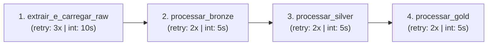

# 🏛️ ETL ITI - ICP-Brasil (Databricks Lakehouse & Asset Bundles)


> 🚀 **Status do Projeto:** ✅ **Fases 1 e 2 Concluídas e Integradas no Lakehouse**  
> - **Fase 1 (Concluída):** Esteira de dados cadastrais e mestres das entidades ICP-Brasil (Extração, Normalização, PySpark Serverless, Modelagem Dimensional e AI/BI Dashboard).  
> - **Fase 2 (Concluída):** Ingestão e ETL analítico do portal **ITI em Números** (volumetria agregada de emissões por UF, período, modalidade e credenciamento), com staging, merge idempotente na Silver (`tbl_silver_numeros`) e 5 tabelas analíticas Gold otimizadas via *Liquid Clustering*.  
> - **Fase 3 (Em Andamento):** Analytics conversacional via **Databricks Genie** e expansão dos painéis analíticos com cruzamento de infraestrutura instalada vs. demanda de mercado.

---

## 1. 📌 Introdução e Visão Geral da Arquitetura

O presente projeto realiza a extração automatizada, o processamento e a disponibilização analítica dos dados abertos governamentais disponibilizados pelo **Instituto Nacional de Tecnologia da Informação (ITI)**. O fluxo integra tanto o cadastro das entidades certificadoras da ICP-Brasil (ACs, ARs, ACTs, PSS, etc.) quanto as estatísticas consolidadas de emissões de certificados digitais no território nacional (**ITI em Números**).

A arquitetura de dados segue o padrão **Medalhão** no **Databricks Lakehouse**, garantindo rastreabilidade, governança via **Unity Catalog**, resiliência computacional e alta performance de consulta:

```text
                  [ APIs Oficiais do ITI / ICP-Brasil ]
                    ├── API de Entidades Credenciadas
                    └── API do Painel ITI em Números
                                  │
                                  ▼ (Módulo de Extração & Flatten)
┌──────────────────────────────────────────────────────────────────────────────────┐
│ Camada 0_raw (Volumes do Unity Catalog)                                          │
│ ├── Volume: /Volumes/lakehouse_iti/0_raw/raw/entidades.json                      │
│ └── Volume: /Volumes/lakehouse_iti/0_raw/raw/numeros.json                        │
└─────────────────────────────────┬────────────────────────────────────────────────┘
                                  │
                                  ▼ (Conversão CSV & Statement Execution API / Databricks Jobs)
┌──────────────────────────────────────────────────────────────────────────────────┐
│ Camada 1_bronze (Volumes & Tabelas Delta Brutas)                                 │
│ ├── Volume: /Volumes/lakehouse_iti/1_bronze/raw/entidades.csv                    │
│ ├── Volume: /Volumes/lakehouse_iti/1_bronze/raw/numeros.csv                      │
│ ├── Tabela Delta: lakehouse_iti.1_bronze.entidades (metadados e auditoria)        │
│ └── Tabela Delta: lakehouse_iti.1_bronze.numeros (indicadores e séries brutas)   │
└─────────────────────────────────┬────────────────────────────────────────────────┘
                                  │
                                  ▼ (Transformações, Deduplicação, PySpark & MERGE com Hash SHA2)
┌──────────────────────────────────────────────────────────────────────────────────┐
│ Camada 2_silver (Tabelas Delta Normalizadas, Tipadas & Enriquecidas)             │
│ ├── Entidades:   lakehouse_iti.2_silver.tbl_entidades (CNPJs formatados e situac)│
│ ├── Endereços:   lakehouse_iti.2_silver.tbl_enderecos (região e end. consolidado)│
│ ├── Hierarquia:  lakehouse_iti.2_silver.tbl_hierarquia (relações pai/filho)      │
│ ├── Staging Núm: lakehouse_iti.2_silver.stg_silver_numeros (flags e glossário)   │
│ └── Fato Números:lakehouse_iti.2_silver.tbl_silver_numeros (MERGE idempotente)   │
└─────────────────────────────────┬────────────────────────────────────────────────┘
                                  │
                                  ▼ (Modelagem Dimensional, Liquid Clustering & CTEs Recursivas)
┌──────────────────────────────────────────────────────────────────────────────────┐
│ Camada 3_gold (Tabelas Delta de Consumo & Visões Analíticas Otimizadas)          │
│ ├── Dimensão:    lakehouse_iti.3_gold.dim_entidade (visão 360º de autoridades)   │
│ ├── Dimensão:    lakehouse_iti.3_gold.dim_hierarquia (subordinação direta)       │
│ ├── Fato Cadeia: lakehouse_iti.3_gold.fato_metricas_entidades (CTE recursiva)    │
│ ├── Fato Séries: lakehouse_iti.3_gold.fato_emissao_mensal (CLUSTER BY Ano, Tipo) │
│ ├── Fato Mapa:   lakehouse_iti.3_gold.fato_distribuicao_geografica (CLUSTER UF)  │
│ ├── Fato Corte:  lakehouse_iti.3_gold.fato_segmentacao_certificados (A1/A3, PF) │
│ ├── Fato Infra:  lakehouse_iti.3_gold.fato_infraestrutura_credenciamento         │
│ └── KPI Resumo:  lakehouse_iti.3_gold.kpi_resumo_executivo (Metas e Comps)       │
└─────────────────────────────────┬────────────────────────────────────────────────┘
                                  │
                                  ▼ (Consumo Analítico, Visualização & IA)
┌──────────────────────────────────────────────────────────────────────────────────┐
│ Camada de BI & Analytics (Databricks AI/BI & Genie Conversational Space)         │
│ ├── Painel: Painel de Entidades ITI (Lakeview Dashboard versionado como código)  │
│ └── Genie:  Espaço Semântico Conversacional (consultas analíticas em linguagem NL)│
└──────────────────────────────────────────────────────────────────────────────────┘
```

---

## 2. 🗂️ Estrutura de Diretórios do Projeto

A organização de diretórios e arquivos do repositório está estruturada conforme a seguir:

```text
etl-iti-icp-brasil/
├── .github/                             # Automações de Integração e Entrega Contínuas (CI/CD)
│   └── workflows/
│       └── python-cicd-implementacao.yml# Pipeline de validação estática, testes e deploy Databricks
│
├── .vscode/                             # Configurações de ambiente de desenvolvimento local
│   └── settings.json                    # Definições do interpretador e linters
│
├── docs/                                # Documentação técnica e relatórios visuais
│   └── dashboards/                      # Ativos visuais e relatórios do dashboard
│       ├── Painel de Entidades ITI.pdf  # Captura oficial em PDF exportada do Databricks
│       └── painel_entidades_iti_readme.png # Captura visual do painel incorporada na documentação
│
├── resources/                           # Definições declarativas de recursos no Databricks (DABs)
│   ├── dashboards/                      # Especificações de dashboards (Lakeview / AI/BI)
│   │   └── Painel de Entidades ITI.lvdash.json # Definição declarativa do dashboard
│   ├── ITI_ICP_BRASIL_dashboard.yml     # Declaração do Dashboard AI/BI no Asset Bundle
│   └── ITI_ICP_BRASIL_job.yml           # Definição do Databricks Workflow Job (Serverless ETL)
│
├── src/                                 # Código-fonte principal da aplicação
│   └── ITI_ICP_BRASIL/                  # Pacote Python para extração, tratamento e carga
│       ├── __init__.py                  # Inicialização do módulo Python
│       ├── __main__.py                  # Ponto de entrada para execução como módulo (python -m)
│       ├── main.py                      # Ponto de entrada de execução do pacote (CLI entrypoint)
│       ├── pipeline.py                  # Orquestração da pipeline modular fim a fim
│       ├── assets/                      # Módulo de comunicação e consumo de APIs externas
│       │   ├── __init__.py
│       │   └── url_iti.py               # Extração de dados das APIs oficiais de entidades e números
│       ├── processamento/               # Módulo de transformação e normalização de dados
│       │   ├── __init__.py
│       │   └── flatten.py               # Algoritmo de desaninhamento recursivo de estruturas JSON
│       ├── exportacao/                  # Módulo de carga e persistência de dados
│       │   ├── __init__.py
│       │   ├── upload_raw.py            # Upload de dados brutos (JSON) para Volumes Raw
│       │   ├── upload_bronze.py         # Conversão para CSV, upload no Bronze e tabelas Delta
│       │   ├── upload_silver.py         # Pipeline Silver (PySpark, normalização, flags e MERGE)
│       │   └── upload_gold.py           # Modelagem dimensional e fatos analíticos via helper resiliente
│       └── config/                      # Configurações gerais, parâmetros e glossário
│           ├── __init__.py
│           ├── config.py                # Resolução inteligente de warehouse_id e credenciais
│           ├── glossario.py             # Mapeamento semântico de flags, indicadores e macrorregiões
│           └── logger.py                # Logger centralizado estruturado com emojis
│
├── tests/                               # Suíte de testes automatizados
│   ├── conftest.py                      # Configurações globais e fixtures do pytest (Spark/Connect)
│   ├── test_logger.py                   # Testes de formatação e emissão de logs
│   └── test_package.py                  # Testes unitários do pacote e resolução de variáveis
│
├── databricks.yml                       # Configuração declarativa do Databricks Asset Bundle (DAB)
├── pyproject.toml                       # Especificação do projeto e gerenciamento de dependências
├── uv.lock                              # Registro determinístico de versões de dependências
├── .gitignore                           # Regras de exclusão de arquivos no controle de versão
└── README.md                            # Documentação técnica principal do projeto
```

---

## 3. 🛠️ Tecnologias e Especificações Técnicas

O projeto utiliza ferramentas e padrões modernos de Engenharia de Dados em Nuvem:

- **Plataforma e Orquestração:** [Databricks Asset Bundles (DABs)](https://docs.databricks.com/dev-tools/bundles/index.html) com compilação automatizada em pacotes Wheel (`.whl`).
- **Motor de Computação Distribuída:** Apache Spark / PySpark & [Databricks Workflows](https://docs.databricks.com/workflows/index.html) (Serverless Compute).
- **Execução Local Remota:** [Databricks Connect](https://docs.databricks.com/dev-tools/databricks-connect/python/index.html) com computação Serverless (`DatabricksSession.builder.serverless(True)`).
- **Armazenamento e Governança:** Databricks Unity Catalog (`Volumes` gerenciados, schemas medalhão e Tabelas Delta).
- **SDK de Integração:** [Databricks SDK para Python](https://docs.databricks.com/dev-tools/sdk-python.html) (`WorkspaceClient`, `StatementExecutionAPI`, `VolumesAPI`, `FilesAPI`).
- **Técnicas Avançadas de Carga:** 
  - Deduplicação idempotente via `MERGE` utilizando chave unívoca gerada por hash **SHA2-256**.
  - Otimização de consultas analíticas com **Liquid Clustering** (`CLUSTER BY`) no Unity Catalog.
- **Modelagem Dimensional:** Star Schema (Dimensões e Fatos) com CTEs recursivas para desdobramento de hierarquias complexas.
- **Gerenciador de Dependências e Ambientes:** [Astral uv](https://docs.astral.sh/uv/) / [Hatchling](https://hatch.pypa.io/).
- **Análise Estática de Código e Formatação:** [Ruff](https://astral.sh/ruff) (`line-length = 120`).
- **Framework de Testes Automatizados:** [pytest](https://docs.pytest.org/) com fixtures desacopladas para testes locais e remotos.
- **Integração e Entrega Contínuas (CI/CD):** GitHub Actions com matriz de versões (`Python 3.10`, `3.11`, `3.12`), validação estática e deploy automático do Bundle.

---

## 4. 🚀 Guia de Instalação e Configuração do Ambiente

### 4.1. Pré-requisitos
- **Interpretador Python:** Versão `>=3.10, <3.13`
- **Gerenciador UV:** [Documentação de Instalação do UV](https://docs.astral.sh/uv/getting-started/installation/)
- **Databricks CLI:** [Documentação de Instalação da Databricks CLI v0.200+](https://docs.databricks.com/dev-tools/cli/databricks-cli.html)

### 4.2. Inicialização do Ambiente Virtual

Execute a sincronização determinística do ambiente e instalação de dependências de desenvolvimento:

```bash
uv sync --dev
```

### 4.3. Autenticação no Databricks

Configure as credenciais do Databricks no seu arquivo `~/.databrickscfg` ou utilize o comando da CLI:

```bash
databricks auth login --host https://<seu-workspace-id>.cloud.databricks.com
```

---

## 5. ⚙️ Execução da Pipeline de ETL

O fluxo completo de ponta a ponta (Raw ➔ Bronze ➔ Silver ➔ Gold) é orquestrado de forma modular e pode ser executado unificadamente através do ponto de entrada principal do projeto:

### 5.1. Execução Fim a Fim e Modular

```bash
# Execução da esteira completa de ponta a ponta (todas as 4 camadas)
uv run main
# ou
python -m ITI_ICP_BRASIL

# Execução direcionada de etapas individuais (scripts registrados no pyproject.toml)
uv run run_raw      # Extrai entidades e números das APIs e grava nos Volumes Raw
uv run run_bronze   # Converte JSONs para CSV e carrega tabelas Delta Bronze
uv run run_silver   # Normalização PySpark Serverless e MERGE idempotente da Silver
uv run run_gold     # Dimensões e Fatos analíticos otimizados via SQL Warehouse
```

### 5.2. Etapas Executadas pela Pipeline Modular

Ao ser executada, a função `pipeline()` em `src/ITI_ICP_BRASIL/pipeline.py` orquestra sequencialmente as seguintes etapas:

| Ordem | Etapa / Função | Camada | Descrição Técnica |
| :---: | :--- | :---: | :--- |
| **1** | `upload_volume_iti_entidades()` | **0_raw** | Extrai entidades credenciadas da API oficial e grava em `/Volumes/lakehouse_iti/0_raw/raw/entidades.json`. |
| **2** | `upload_volume_iti_numeros()` | **0_raw** | Extrai séries estatísticas do ITI em Números e grava em `/Volumes/lakehouse_iti/0_raw/raw/numeros.json`. |
| **3** | `upload_volume_bronze_iti_entidades()` | **1_bronze** | Converte JSON de entidades para CSV e persiste no Volume Bronze. |
| **4** | `upload_volume_bronze_iti_numeros()` | **1_bronze** | Converte JSON de números para CSV e persiste no Volume Bronze. |
| **5** | `upload_tabela_bronze_iti_entidades()` | **1_bronze** | Cria/atualiza a tabela Delta `lakehouse_iti.1_bronze.entidades` com metadados de auditoria. |
| **6** | `upload_tabela_bronze_iti_numeros()` | **1_bronze** | Cria/atualiza a tabela Delta `lakehouse_iti.1_bronze.numeros` com metadados de auditoria. |
| **7** | `upload_silver_entidades()` | **2_silver** | Processa via PySpark a tabela `lakehouse_iti.2_silver.tbl_entidades` com limpeza de CNPJ e deduplicação. |
| **8** | `upload_silver_enderecos()` | **2_silver** | Processa via PySpark a tabela `lakehouse_iti.2_silver.tbl_enderecos` com enriquecimento de região (UF) e endereço. |
| **9** | `upload_silver_hierarquia()` | **2_silver** | Processa via PySpark a tabela `lakehouse_iti.2_silver.tbl_hierarquia` desdobrando as entidades pai. |
| **10** | `create_tabela_silver_numeros()` | **2_silver** | Cria a DDL da tabela analítica `lakehouse_iti.2_silver.tbl_silver_numeros`. |
| **11** | `upload_staging_silver_numeros()` | **2_silver** | Aplica o [glossario.py](src/ITI_ICP_BRASIL/config/glossario.py) gerando a staging temporária normalizada `stg_silver_numeros`. |
| **12** | `merge_tabela_silver_numeros()` | **2_silver** | Executa o `MERGE` idempotente na `tbl_silver_numeros` com chave SHA2-256 e particionamento inteligente. |
| **13** | `upload_gold()` | **3_gold** | Executa o orquestrador Gold criando de forma resiliente as 3 dimensões e 5 fatos analíticos no Unity Catalog. |

---

### 5.3. Modelagem e Tabelas Geradas por Camada

#### Camada 1_bronze (Tabelas Brutas Estruturadas)
- `lakehouse_iti.1_bronze.entidades`: Cadastro bruto de autoridades com campos adicionais de auditoria (`nome_arquivo`, `data_insercao`).
- `lakehouse_iti.1_bronze.numeros`: Dados brutos desaninhados do portal estatístico ITI em Números.

#### Camada 2_silver (Tabelas Delta Tipadas, Normalizadas & Enriquecidas)
- `lakehouse_iti.2_silver.tbl_entidades`: Entidades limpas, CNPJ com máscara padronizada (`LPAD` de 14 dígitos), `data_credenciamento` tipada, situação e deduplicação por chave primária (`id_entidade`).
- `lakehouse_iti.2_silver.tbl_enderecos`: Endereços normalizados com campo consolidado `endereco_completo` e enriquecimento de `regiao` (Sudeste, Sul, Nordeste, Centro-Oeste e Norte).
- `lakehouse_iti.2_silver.tbl_hierarquia`: Relações de subordinação direta e indireta entre entidades (`id_entidade`, `id_entidade_pai`, `nivel_hierarquia_filho`).
- `lakehouse_iti.2_silver.tbl_silver_numeros`: Fato analítica consolidada contendo todas as séries temporais, métricas de emissão e credenciamento, com chave única `CD_CHAVE_INDICADOR` (hash SHA2-256).

#### Camada 3_gold (Modelagem Dimensional Star Schema & Visões Analíticas)
- `lakehouse_iti.3_gold.dim_entidade`: Dimensão mestre de entidades enriquecida com localização geográfica e auditoria (`DT_CARGA_DW`).
- `lakehouse_iti.3_gold.dim_hierarquia`: Dimensão com relações relacionais de subordinação hierárquica.
- `lakehouse_iti.3_gold.fato_metricas_entidades`: Fato calculada via **CTE Recursiva** (`WITH RECURSIVE hierarquia_completa`), consolidando métricas da cadeia para cada autoridade:
  - `NR_AGREGADOS_AC_NIVEL_1`: Quantidade de ACs de 1º Nível subordinadas.
  - `NR_AGREGADOS_AC_NIVEL_2`: Quantidade de ACs de 2º Nível subordinadas.
  - `NR_AGREGADOS_AR`: Quantidade total de ARs na cadeia consolidada.
- `lakehouse_iti.3_gold.fato_emissao_mensal`: Séries temporais de emissão mensal e históricos anuais (Ativos vs. Emitidos), agrupadas e otimizadas com `CLUSTER BY (DT_ANO, DS_TIPO_SERIE)`.
- `lakehouse_iti.3_gold.fato_distribuicao_geografica`: Métricas agregadas por UF e Macrorregião, otimizadas com `CLUSTER BY (SG_UF, DT_ANO)`.
- `lakehouse_iti.3_gold.fato_segmentacao_certificados`: Cortes analíticos por tipo de certificado (`A1`, `A3`) e titularidade (`PESSOA FISICA`, `PESSOA JURIDICA`, `EQUIPAMENTO`), otimizadas com `CLUSTER BY (DT_ANO, DS_CATEGORIA_CORTE)`.
- `lakehouse_iti.3_gold.fato_infraestrutura_credenciamento`: Histórico de credenciamento de novos pontos de atendimento (ARs) ao longo do tempo, otimizadas com `CLUSTER BY (DT_ANO, DT_MES_ANO)`.
- `lakehouse_iti.3_gold.kpi_resumo_executivo`: Indicadores estratégicos de resumo executivo, comparativos absolutos e percentuais e metas/projeções para tomada de decisão, otimizadas com `CLUSTER BY (DS_TIPO_INDICADOR, DS_INDICADOR)`.

---

### 5.4. Comandos do Databricks Asset Bundle (DAB)

```bash
# Validação sintática das configurações e declarações do bundle
databricks bundle validate

# Deploy em ambiente de desenvolvimento (dev)
databricks bundle deploy

# Deploy em ambiente de produção (prod)
databricks bundle deploy --target prod

# Execução do Workflow Job gerenciado no Databricks (Serverless)
databricks bundle run ITI_ICP_BRASIL_job
```

#### 5.4.1. Arquitetura da DAG de Tarefas no Databricks Workflows

O job gerenciado no Databricks opera como um Grafo Acíclico Dirigido (DAG) modularizado em 4 tarefas encadeadas com políticas automáticas de **retry** para máxima resiliência operacional:


```mermaid
graph LR
    A["1. extrair_e_carregar_raw<br/>(retry: 3x | int: 10s)"] --> B["2. processar_bronze<br/>(retry: 2x | int: 5s)"]
    B --> C["3. processar_silver<br/>(retry: 2x | int: 5s)"]
    C --> D["4. processar_gold<br/>(retry: 2x | int: 5s)"]
```

- **Isolamento de Falhas:** Caso ocorra instabilidade temporária nas APIs governamentais do ITI, apenas a tarefa `extrair_e_carregar_raw` é reexecutada (até 3 tentativas).
- **Eficiência Computacional:** Se houver erro em uma camada posterior (como Silver ou Gold), o Databricks reexecuta apenas a tarefa com falha, preservando os dados já processados nas etapas anteriores sem custo redundante de computação.
- **Agendamento Automático (*Cron Schedule*):** O job é programado para execução diária às **08:00 (Horário de Brasília — `America/Sao_Paulo`)**, operando de forma 100% autônoma no ambiente de Produção.

---

## 6. 📊 Painel de Visualização & Analytics (Databricks AI/BI Dashboard)

O projeto inclui o painel analítico oficial **Painel de Entidades ITI**, implementado no **Databricks AI/BI Lakeview** e versionado como código declarativo (`resources/dashboards/Painel de Entidades ITI.lvdash.json`) integrado diretamente ao Databricks Asset Bundle (`resources/ITI_ICP_BRASIL_dashboard.yml`).


### 6.1. Datasets e Rastreabilidade com as Tabelas Gold

O dashboard consome diretamente a modelagem dimensional criada na Camada 3_gold do Lakehouse:

| Dataset no Dashboard | Tabela Gold Origem | Tipo de Consulta / Agregação |
| :--- | :--- | :--- |
| `dim_entidade` *(Metric View)* | `lakehouse_iti.3_gold.dim_entidade` | Métricas agregadas e filtros globais (`SG_UF`, `DS_REGIAO`, `DS_TIPO`, `DS_SITUACAO`). |
| `top_ufs` | `lakehouse_iti.3_gold.dim_entidade` | Agrupamento por `SG_UF` com ordenação decrescente (Top 10). |
| `top_agregados` | `lakehouse_iti.3_gold.fato_metricas_entidades` | CTE analítica somando métricas de agregação por autoridade. |
| `evolucao` | `lakehouse_iti.3_gold.dim_entidade` | Série temporal agrupada por `YEAR(DT_CREDENCIAMENTO)` e `DS_TIPO`. |
| `agregados_regiao` | `lakehouse_iti.3_gold.dim_entidade` | Distribuição categórica cruzada por macrorregião geográfica. |
| `hierarquia` | `lakehouse_iti.3_gold.dim_hierarquia` + `dim_entidade` | Self-join relacional entre ancestrais e subordinados diretos. |

### 6.2. Deploy Declarativo do Dashboard via Databricks Asset Bundle (DAB)

O dashboard é gerenciado como código (*Dashboard-as-Code*) através do arquivo declarativo [`resources/ITI_ICP_BRASIL_dashboard.yml`](resources/ITI_ICP_BRASIL_dashboard.yml). Ao executar o deploy do bundle, o dashboard é provisionado e vinculado automaticamente ao SQL Warehouse do workspace:

```bash
# Valida a integridade da pipeline e do dashboard
databricks bundle validate

# Deploy do Workflow Job e do Dashboard no Databricks
databricks bundle deploy
```

---

## 7. 🧪 Qualidade de Software e Testes Automatizados

Para garantir a confiabilidade, manutenibilidade e conformidade das diretrizes de desenvolvimento:

```bash
# Execução da suíte de testes unitários
uv run pytest

# Execução do linter e verificação de boas práticas (Ruff)
uv run ruff check .

# Aplicação de correções e formatação automática
uv run ruff format .
```

---

## 8. 🗺️ Roadmap de Evolução: Databricks Genie & Analytics Avançado

Com as **Fases 1 e 2 concluídas**, o Lakehouse dispõe da cadeia mestra de entidades e de todo o histórico analítico de emissões e credenciamentos.

A **Fase 3** do projeto concentrará as seguintes entregas:

1. **Analytics Conversacional com Databricks Genie (AI/BI):**
   - Criação de um **Genie Space** conectado às tabelas dimensionais e métricas no Unity Catalog (`lakehouse_iti.3_gold.*`), permitindo que analistas formulem perguntas em linguagem natural:
     - *"Qual o crescimento anual de certificados A1 na Região Sudeste em comparação com o total de ARs ativas?"*
     - *"Quais estados possuem a maior relação de emissões por autoridade credenciada?"*
2. **Correlação de Oferta Instalada vs. Demanda de Mercado:**
   - Cruzamento das séries de emissão com a `dim_entidade` para identificar regiões de alta demanda com potencial desassistência de postos físicos de atendimento.
3. **Expansão do AI/BI Dashboard:**
   - Adição de abas de séries temporais de emissão, segmentação PF/PJ e mapas temáticos de calor alimentados pelas novas tabelas Gold.
